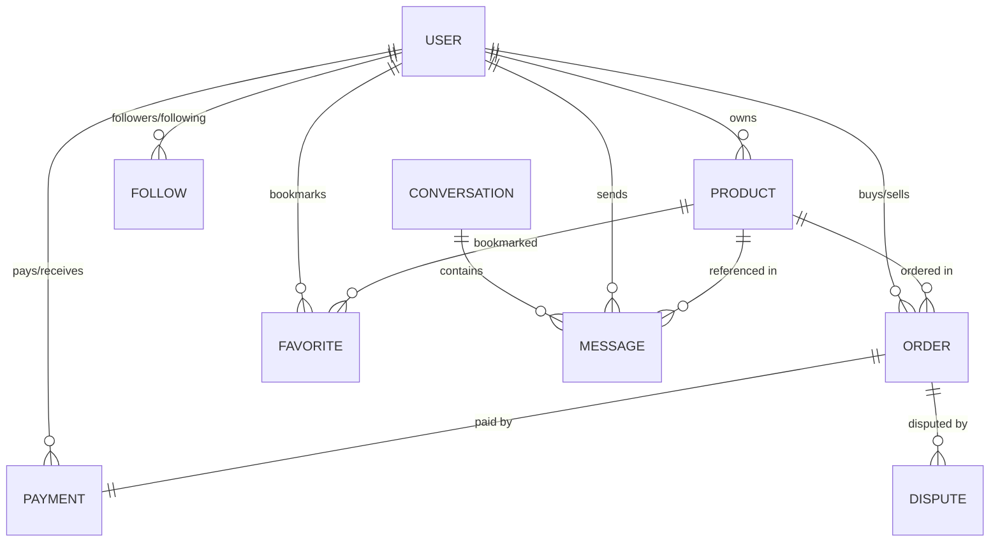

# Djarna Backend API

A robust, production-grade backend API for **Djarna** — a peer-to-peer (P2P) social marketplace application. It supports product listings, real-time messaging, negotiation bidding/offers, secure payments, order management, feedback reviews, and push notifications.

---

## 🚀 Core Features

### 👤 Authentication & Profiles
- **JWT-Based Authentication**: Secure access token and refresh token rotation.
- **OTP Verification**: Email-based and SMS-based OTP verification using Nodemailer and Twilio.
- **Social Login**: Integrated passport strategies for Apple, Google, and Facebook auth.
- **Identity Verification**: Document upload and review workflows for KYC and verified user badging.
- **Follow System**: Users can follow and unfollow sellers, tracking popular merchants.

### 🛍️ Product Listings
- **Search & Filters**: Multi-criteria search (terms, category, subcategory, sub-subcategories, price limits, gender, sizes, brands, etc.).
- **Effective Boosting**: Dynamic promotional package calculations (`isEffectiveBoosted` checks expiration dates in real-time).
- **Favorites & Wishlist**: Bookmark favorite items for future purchasing.

### 💬 Real-Time Chat & Offers
- **WebSockets (Socket.io)**: Real-time messaging and chat threads sync.
- **Rich Message Formats**: Standard text, location sharing, and file attachments (images, PDFs, documents).
- **Negotiation System**:
  - Propose custom price and shipping offers.
  - Real-time offer updating, accepting, counter-offering, or rejecting.
  - Automatic push notifications and socket sync alerts on state changes.

### 💳 Orders & Payments
- **Secure Checkouts**: Built-in payment flow utilizing the **Paydunya** invoice checkouts and redirect mechanisms.
- **Payment Webhooks**: Paydunya webhook integrations to capture successful transactions, automatically mark products as SOLD, create orders, and complete pending offers.
- **Dispute Claims**: Users can raise order disputes to claim refunds.

### 🔔 Notifications & Cron Jobs
- **Push Notifications**: Firebase Cloud Messaging (FCM) integration for direct device alerts.
- **Cron Schedules**: Automatic cleanups for expired boost packages and uncompleted/cancelled actions.

---

## 🛠️ Technology Stack
- **Runtime**: [Node.js](https://nodejs.org/) (v18+)
- **Language**: [TypeScript](https://www.typescriptlang.org/)
- **Web Framework**: [Express.js](https://expressjs.com/)
- **Database**: [MongoDB](https://www.mongodb.com/) (using [Mongoose ODM](https://mongoosejs.com/))
- **Real-Time Communication**: [Socket.io](https://socket.io/)
- **Push Notification Service**: [Firebase Admin SDK](https://firebase.google.com/docs/admin)
- **Validation Middleware**: [Zod](https://zod.dev/)
- **File Uploads**: [Multer](https://github.com/expressjs/multer) & [Sharp](https://sharp.pixelplumbing.com/) (image optimization)

---

## 🧠 System Architecture & Workflow Analysis

### 1. Real-Time WebSockets Architecture (Socket.io)
The system initiates a central Socket.io service mapped onto the HTTP server. Clients authenticate during handshake (`_id` and `role`).
- **Room Structure**:
  - `user_${userId}`: Individual user room where real-time chat updates, read statuses, and personal notification sync events are emitted.
  - `admin_room`: Room joined exclusively by users with the `ADMIN` role. Receives real-time dashboard events and system action logs.
- **Key Events**:
  - `message_updated`: Sent to conversation participants when a message text changes or when an offer status changes (`ACCEPTED`/`REJECTED`).
  - `conversation_deleted` / `message_deleted`: Notifies the user's active client session to clear the cached views.
  - `new_activity`: Admin-specific push event logging actions (e.g. product listings, disputes, checkouts) dynamically onto the admin dashboards.

### 2. P2P Bidding & Negotiation Flow
Negotiation parameters are stored directly on the message model to preserve the contextual sequence of the negotiation:
- **Offering**: Buyers propose a deal by emitting a message of type `OFFER` accompanied by `offerPrice` and optional `shippingPrice`.
- **Counter-Offering / Updating**: Either participant can update the offer details through the `/offer-price` patch, automatically triggering real-time Socket syncing and Firebase Push alerts.
- **Accepting & Rejecting**: Modifying the offer status (to `ACCEPTED` or `REJECTED`) sends push notifications back to the offer sender to prompt them to check out.
- **Completion**: Once payment is completed via the webhook checkouts, the status shifts to `COMPLETED`, locking down modifications and closing negotiation.

### 3. Automated Background Operations (Cron Jobs)
Automated tasks are scheduled using `node-cron` to maintain system consistency and clean stale states:
- **Product Boost Cleanup** (Runs every 12 hours: `0 */12 * * *`):
  - Scans for products where `isBoosted` is true but `boostEndTime` has passed.
  - Reverts boost properties and dispatches a push notification (`Boost terminé`) to notify the listing owner.
- **Escrow Release Agent** (Runs every hour: `0 * * * *`):
  - Checks complete orders and finds payments where escrow is enabled (`escrow: true`), the countdown holds (`escrowReleaseAt < now`), and funds have not yet been disbursed.
  - Releases funds, increments the seller's active wallet balance, fires socket alerts, marks the order state as `COMPLETED`, updates product inventory status to `SOLD`, and notifies the seller via FCM.

### 4. Memory-Storage Upload & Image Compression Pipeline (Multer + Sharp)
To prevent disk storage leaks from unprocessed original images, the upload pipeline processes binary streams directly inside memory buffers:
- **Multer Configuration**: Parses incoming multipart form streams into a temporary RAM buffer (`multer.memoryStorage()`) limiting image files to `5MB` (or general message files up to `15MB`).
- **Sharp WebP Compression Engine**:
  - **Profiles**: Converted to high-efficiency `.webp` format at a quality parameter of `80`.
  - **Marketplace Listings**: Scaled to a max dimension bounding box of `800x800px` (preserving aspect ratio via `fit: "inside"`) and exported as WebP (quality 80) to maximize loading speeds on mobile client feeds.
  - **KYC Verification Documents / Disputes**: Scaled to a bounding box of `1200x1200px` and encoded to WebP to balance clarity and low storage overhead.
  - **Category Icons**: Resized to a thumbnail cover of `200x200px` at quality `70`.
  - **Message Attachments**: General files (e.g. PDFs, ZIPs) bypass the Sharp compression pipeline and write directly to disk, whereas images are converted to WebP on the fly.

### 5. Third-Party Integrations
- **Paydunya Checkout Gateway**: Integrates sandbox and live checkouts via redirection tokens. Includes IPN webhook listeners validating invoices, updating payment schemas (`status`, `receiptUrl`), marking listing items as `SOLD`, and triggering notifications.
- **Twilio SMS Gateway**: Dispenses mobile verification OTP notifications to validate phone number authenticity.
- **Nodemailer SMTP**: Triggers secure registration/recovery emails and transactional checks.

---

## 🗄️ Database Relationships & Schemas Analysis

Below is an overview of the core database schema models and how they relate:



- **UserModel**: Holds authentication metrics (`password`, `isActive`), security credentials (`fcmTokens`, `referralCode`, `referredBy`), identity verification checkpoints (`verifiedBadge: boolean`), and active financial variables (`balance`).
- **ProductModel**: Details marketplace items. Intersects with `UserModel` (owner reference) and `BoostPackModel` (holds active boost time boundaries).
- **OrderModel**: Governs checkout states (`PENDING`, `SHIPPED`, `DELIVERED`, `COMPLETED`, `CANCELLED`). Maps a single product item with a buyer, seller, delivery address, and payment transaction record.
- **PaymentModel**: Manages transactional funds, platform processing fees (`buyerFee`, `siteFee`), and escrow conditions (`escrow`, `escrowReleaseAt`, `escrowReleasedAt`).
- **MessageModel**: Holds conversation events (`MESSAGE`, `LOCATION`, `OFFER`, `ACCEPTED`, `REJECTED`, `COMPLETED`). References the product item under negotiation, and contains pricing updates.
- **DisputeModel**: Created when a buyer flags an order issue, capturing disputes, reasons, reference documents, and payout status (`PENDING`, `RESOLVED`, `REFUNDED`).

---

## ⚙️ Initial Startup Seeding
During initialization, the application executes pre-start seeding scripts to guarantee baseline security and settings:
- **Admin Seeding (`seedAdmin`)**: Creates a default Super Administrator user from `.env` parameters if no admin account exists in the database.
- **Platform Seeding (`seedSettings`)**: Pre-populates the settings collection with platform configurations (such as a default `10%` commission rate and a standard `7` days escrow release countdown).

---

## ⚙️ Setup and Installation

### 1. Clone the repository & Install dependencies
```bash
git clone <repository-url>
cd Djarna_App_Backend
npm install
```

### 2. Configure Environment Variables
Create a `.env` file in the root directory and copy the contents from `.env.example`:
```bash
cp .env.example .env
```
Fill in the values for your MongoDB URL, JWT tokens, Twilio credentials, and Paydunya merchant keys.

### 3. Setup Firebase Service Account
For push notifications, place your Firebase Private Key JSON file inside the `config/` directory with the name:
`djarna-b212e-firebase-adminsdk-fbsvc-ed19886f3e.json`

---

## 🏃 Running the Application

### Development Mode (with hot-reloads)
```bash
npm run dev
```

### Production Build
```bash
# Compile TypeScript to JavaScript in /dist
npm run build

# Start production server
npm run start
```

### Linter Checks
```bash
# Run ESLint rules check
npm run lint

# Automatically resolve fixing rules
npm run lint:fix
```
