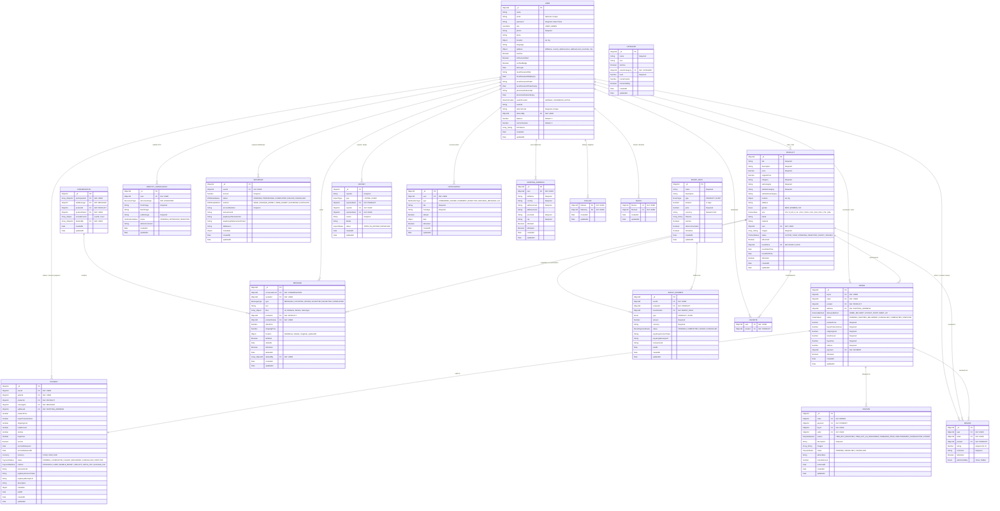

# Djarna Backend API

> [](https://dashboard.djarna.com)  
> [](https://play.google.com/store/apps/details?id=com.mohamed.djarna)  
> [](https://apps.apple.com/us/app/djarna/id6787214492)

A robust, production-grade backend API for **Djarna** — a peer-to-peer (P2P) social marketplace application. It supports product listings, real-time messaging, negotiation bidding/offers, secure payments, order management, feedback reviews, and push notifications.

---

## 🚀 Core Features & Business Logic

### 👤 1. Authentication, Profiles & Identity Verification (KYC)
- **JWT Authentication & Rotation**: Secure short-lived Access Tokens and Refresh Token rotation mechanisms.
- **Dual SMS & Email OTP Engine**: Phone verification powered by **DExchange SMS** & **Twilio**, with fallback email verification via Nodemailer SMTP.
- **Social OAuth Integration**: One-click authentication with Google OAuth 2.0, Apple ID, and Facebook Passport strategies.
- **KYC Identity Verification Workflow**: Sellers submit National ID / Passport documents and live selfie checks for admin review to earn official `verifiedBadge` status.
- **Social Follow & Block System**: Follow merchants/sellers to receive listing updates, or block problematic accounts.
- **Referral Program & Rewards**: User referral code generation, tracking referral signups (`referredBy`), and granting 0%-commission sales bonus counts (`noCommission`).

### 🛍️ 2. Peer-to-Peer Marketplace & Listing Management
- **Multi-Level Category Taxonomy**: Hierarchical item categorization (`Category` -> `Subcategory` -> `SubSubcategory` -> `SubSubSubcategory`).
- **Advanced Search & Filtering**: Multi-criteria search (keyword, price range, condition, gender, sizes, brands, material, distance radius, category).
- **Listing Promotion & Boost Packs**:
  - Purchase visibility packages (Product Spotlight / Shop Boosts).
  - Dynamic `isEffectiveBoosted` real-time evaluation checking active boost boundaries.
- **Favorites & Wishlists**: Bookmark items and track seller updates.

### 💬 3. Real-Time Chat & Price Offer Negotiation System
- **WebSocket Synchronization (Socket.io)**: Instant message delivery, typing indicators, read receipts (`isRead`), and dynamic unread counters.
- **Rich Media Payload Handling**: Text messages, image uploads, document/PDF attachments, and live GPS location sharing (`location`).
- **Interactive Price Bidding & Counter-Offers**:
  - Buyers send custom price (`offerPrice`) and shipping (`shippingPrice`) proposals directly in chat threads.
  - Sellers accept, counter-offer, or reject proposals in real-time with instant Socket sync and FCM notifications.
  - Automatic locking and shift to `COMPLETED` state once checkout is finished.

### 💳 4. Secure Payments, Orders & Automated Escrow Hold
- **Multi-Channel Paydunya Checkout**: Integration with Paydunya invoice gateways supporting credit/debit cards, mobile wallets, Wave, Orange Money, Free Money, and Expresso.
- **Instant Webhook Reconciliation (IPN)**: Webhook listeners validate payment integrity, update payment states to `COMPLETED`, automatically set product status to `SOLD`, and generate order records.
- **Escrow Hold & Automated Disbursement**:
  - Buyer payments are locked in escrow (`escrow: true`) with customizable release countdowns (`escrowReleaseAt`).
  - Automated hourly cron jobs disburse funds to the seller's available wallet balance (`balance`) upon delivery confirmation or escrow expiry.
- **Order Logistics Tracking**: Fulfillment lifecycle tracking (`PENDING` -> `PROCESSING` -> `SHIPPED` -> `DELIVERED` -> `COMPLETED`).

### 💸 5. Seller Wallet & Mobile Money Withdrawals
- **Wallet Earnings Hub**: Real-time balance tracking, gross earnings auditing, and commission subtractions.
- **Automated Payout Disbursements**: Sellers request wallet payouts via Wave, Orange Money, Free Money, Expresso, or Paydunya.
- **Instant Disbursement API**: Automated administrative approval triggering Paydunya Disbursement endpoints directly to seller mobile numbers.

### 🚩 6. Moderation, Dispute Resolution & Reviews
- **Order Conflict Disputes**: Buyers can flag non-deliveries or damaged goods (`ITEM_NOT_RECEIVED`, `ITEM_NOT_AS_DESCRIBED`), freezing escrow payout until admin resolution.
- **Community Moderation Reports**: Flag improper listings or abusive user behavior with reason tags and evidence attachments.
- **P2P Star Ratings & Reviews**: Post 1 to 5-star ratings and written reviews upon order completion, updating seller aggregate ratings.

### 🔔 7. Push Notifications & Background Cron Jobs
- **Firebase Cloud Messaging (FCM)**: Target device push alerts for new messages, offer updates, order state changes, boost expiry, and dispute alerts.
- **Automated Cron Cleaning**:
  - `0 */12 * * *`: Scans and cleans expired product boosts, sending expiration alerts.
  - `0 * * * *`: Automated escrow release agent releasing cleared funds to seller wallets.

---

## 🛠️ Technology Stack

- **Runtime**: [Node.js](https://nodejs.org/) (v18+)
- **Language**: [TypeScript](https://www.typescriptlang.org/)
- **Web Framework**: [Express.js](https://expressjs.com/) (v5)
- **Database**: [MongoDB](https://www.mongodb.com/) (using [Mongoose ODM](https://mongoosejs.com/))
- **Real-Time Communication**: [Socket.io](https://socket.io/) (WebSockets engine)
- **Push Notification Service**: [Firebase Admin SDK](https://firebase.google.com/docs/admin) (FCM)
- **Validation Middleware**: [Zod](https://zod.dev/)
- **SMS & Phone OTP Verification**: [DExchange SMS API](https://dexchange-sms.com/) & [Twilio SMS Gateway](https://www.twilio.com/)
- **Payment Gateway & Payout Disbursements**: [Paydunya API Gateway](https://paydunya.com/) (Checkout Invoices, IPN Webhooks & Mobile Disbursements: Wave, Orange Money, Free Money)
- **Authentication & Security**: [JWT (JSON Web Tokens)](https://jwt.io/), [Bcrypt](https://github.com/kelektiv/node.bcrypt.js), [Cookie Parser](https://github.com/expressjs/cookie-parser) & [Cors](https://github.com/expressjs/cors)
- **Social OAuth Login Strategies**: [Passport.js](http://www.passportjs.org/) (`passport-google-oauth20`, `passport-apple`, `passport-facebook`)
- **Transactional Email Gateway**: [Nodemailer](https://nodemailer.com/) (SMTP integration)
- **Automated Background Jobs**: [Node Cron](https://github.com/node-cron/node-cron) (Boost expiration cleanup & automated escrow release engine)
- **File Uploads & Image Processing**: [Multer](https://github.com/expressjs/multer) & [Sharp](https://sharp.pixelplumbing.com/) (RAM memory buffer optimization & WebP image compression)

---

## 🧠 System Architecture & Workflow Analysis

### 1. Real-Time WebSockets Architecture (Socket.io)
The system initiates a central Socket.io service mapped onto the HTTP server. Clients authenticate during handshake (`_id` and `role`).
- **Room Structure**:
  - `user_${userId}`: Individual user room where real-time chat updates, read statuses, and personal notification sync events are emitted.
  - `admin_room`: Room joined exclusively by users with the `ADMIN` role. Receives real-time dashboard events and system action logs.
- **Key Events**:
  - `message_updated`: Sent to conversation participants when a message text changes or when an offer status changes (`ACCEPTED`/`REJECTED`).
  - `conversation_deleted` / `message_deleted`: Notifies the user's active client session to clear the cached views.
  - `new_activity`: Admin-specific push event logging actions (e.g. product listings, disputes, checkouts) dynamically onto the admin dashboards.

### 2. P2P Bidding & Negotiation Flow
Negotiation parameters are stored directly on the message model to preserve the contextual sequence of the negotiation:
- **Offering**: Buyers propose a deal by emitting a message of type `OFFER` accompanied by `offerPrice` and optional `shippingPrice`.
- **Counter-Offering / Updating**: Either participant can update the offer details through the `/offer-price` patch, automatically triggering real-time Socket syncing and Firebase Push alerts.
- **Accepting & Rejecting**: Modifying the offer status (to `ACCEPTED` or `REJECTED`) sends push notifications back to the offer sender to prompt them to check out.
- **Completion**: Once payment is completed via the webhook checkouts, the status shifts to `COMPLETED`, locking down modifications and closing negotiation.

### 3. Automated Background Operations (Cron Jobs)
Automated tasks are scheduled using `node-cron` to maintain system consistency and clean stale states:
- **Product Boost Cleanup** (Runs every 12 hours: `0 */12 * * *`):
  - Scans for products where `isBoosted` is true but `boostEndTime` has passed.
  - Reverts boost properties and dispatches a push notification (`Boost terminé`) to notify the listing owner.
- **Escrow Release Agent** (Runs every hour: `0 * * * *`):
  - Checks complete orders and finds payments where escrow is enabled (`escrow: true`), the countdown holds (`escrowReleaseAt < now`), and funds have not yet been disbursed.
  - Releases funds, increments the seller's active wallet balance, fires socket alerts, marks the order state as `COMPLETED`, updates product inventory status to `SOLD`, and notifies the seller via FCM.

### 4. Memory-Storage Upload & Image Compression Pipeline (Multer + Sharp)
To prevent disk storage leaks from unprocessed original images, the upload pipeline processes binary streams directly inside memory buffers:
- **Multer Configuration**: Parses incoming multipart form streams into a temporary RAM buffer (`multer.memoryStorage()`) limiting image files to `5MB` (or general message files up to `15MB`).
- **Sharp WebP Compression Engine**:
  - **Profiles**: Converted to high-efficiency `.webp` format at a quality parameter of `80`.
  - **Marketplace Listings**: Scaled to a max dimension bounding box of `800x800px` (preserving aspect ratio via `fit: "inside"`) and exported as WebP (quality 80) to maximize loading speeds on mobile client feeds.
  - **KYC Verification Documents / Disputes**: Scaled to a bounding box of `1200x1200px` and encoded to WebP to balance clarity and low storage overhead.
  - **Category Icons**: Resized to a thumbnail cover of `200x200px` at quality `70`.
  - **Message Attachments**: General files (e.g. PDFs, ZIPs) bypass the Sharp compression pipeline and write directly to disk, whereas images are converted to WebP on the fly.

### 5. Third-Party Integrations
- **Paydunya Checkout Gateway**: Integrates sandbox and live checkouts via redirection tokens. Includes IPN webhook listeners validating invoices, updating payment schemas (`status`, `receiptUrl`), marking listing items as `SOLD`, and triggering notifications.
- **Twilio SMS Gateway**: Dispenses mobile verification OTP notifications to validate phone number authenticity.
- **Nodemailer SMTP**: Triggers secure registration/recovery emails and transactional checks.

---

## 🗄️ Database Relationships & Schemas Analysis

Below is the complete database schema architecture for **Djarna Backend API**, accurately matching all 20 module TypeScript interfaces (`User`, `IProduct`, `IOrder`, `IPayment`, `Conversation`, `Message`, `IDispute`, `IIdentityVerification`, `ICategory`, `IReview`, `IWithdraw`, `IBoostPack`, `IBoostPayment`, `IReport`, `IActivity`, `INotification`, `IShippingAddress`, `IFavorite`, `IFollow`, `IBlock`, `IPlatformSettings`) rendered in full diagram view:


```mermaid
erDiagram
    USER {
        ObjectId _id PK
        String name
        String email "Optional, Unique"
        String password "Required, Select false"
        UserRole role "USER | ADMIN"
        String phone "Required"
        String photo
        Object location "lat, lng"
        String language
        Object address "fullName, country, addressLine1, addressLine2, postcode, city"
        Boolean isActive
        Boolean isPhoneVerified
        Boolean verifiedBadge
        Date lastLogin
        String resetPasswordOtp
        Date resetPasswordOtpExpiry
        String resetPasswordToken
        Date resetPasswordTokenExpiry
        String phoneVerificationOtp
        Date phoneVerificationExpiry
        OAuthProvider oauthProvider "GOOGLE | FACEBOOK | APPLE"
        String oauthId
        String referralCode "Required, Unique"
        ObjectId referredBy FK "Ref: USER"
        Number balance "Default: 0"
        Number noCommission "Default: 0"
        Array_String fcmTokens
        Date createdAt
        Date updatedAt
    }

    PRODUCT {
        ObjectId _id PK
        String title "Required"
        String description "Required"
        Number price "Required"
        Number originalPrice
        String category "Required"
        String subcategory "Required"
        String subSubcategory "Required"
        String subSubSubcategory
        Object location "lat, lng"
        String address
        Enum gender "MEN | WOMEN | KID"
        ProductSize size "XS | S | M | L | XL | XXL | XXXL | 4XL | 5XL | 6XL | 7XL | 8XL"
        String brand
        String material
        ObjectId user FK "Ref: USER"
        Array_String images "Required"
        ProductStatus status "ACTIVE | SOLD | PENDING | REJECTED | DRAFT | PAUSED"
        Boolean isBoosted
        ObjectId boostPack FK "Ref: BOOST_PACK"
        Date boostStartTime
        Date boostEndTime
        Boolean isDeleted
        Date createdAt
        Date updatedAt
    }

    ORDER {
        ObjectId _id PK
        ObjectId buyer FK "Ref: USER"
        ObjectId seller FK "Ref: USER"
        ObjectId product FK "Ref: PRODUCT"
        ObjectId address FK "Ref: SHIPPING_ADDRESS"
        DeliveryMethod deliveryMethod "HOME_DELIVERY | PICKUP_POINT | MEET_UP"
        OrderStatus status "PENDING | SHIPPED | DELIVERED | CANCELLED | COMPLETED | DISPUTED"
        Number productPrice "Required"
        Number buyerProtectionFee "Required"
        Number shippingCost "Required"
        Number totalAmount "Required"
        Number buyerFee "Required"
        Number siteFee "Required"
        ObjectId payment FK "Ref: PAYMENT"
        Boolean isDeleted
        Date createdAt
        Date updatedAt
    }

    PAYMENT {
        ObjectId _id PK
        ObjectId userId FK "Ref: USER"
        ObjectId sellerId FK "Ref: USER"
        ObjectId productId FK "Ref: PRODUCT"
        ObjectId messageId FK "Ref: MESSAGE"
        ObjectId addressId FK "Ref: SHIPPING_ADDRESS"
        Number productPrice
        Number buyerProtectionFee
        Number shippingCost
        Number totalAmount
        Number siteFee
        Number buyerFee
        Boolean escrow
        Date escrowReleaseAt
        Date escrowReleasedAt
        Currency currency "FCFA | USD | EUR"
        PaymentStatus status "PENDING | COMPLETED | FAILED | REFUNDED | CANCELLED | DISPUTED"
        PaymentMethod method "PAYDUNYA | CARD | MOBILE_MONEY | WALLET | APPLE_PAY | GOOGLE_PAY"
        String transactionId
        String paydunyaInvoiceToken
        String paydunyaReceiptUrl
        String description
        Object metadata
        Date paidAt
        Date createdAt
        Date updatedAt
    }

    CONVERSATION {
        ObjectId _id PK
        Array_ObjectId participantIds FK "Ref: USER"
        ObjectId lastMessage FK "Ref: MESSAGE"
        ObjectId productId FK "Ref: PRODUCT"
        ObjectId productOwner FK "Ref: USER"
        Array_Object unreadCounts "userId, count"
        Array_ObjectId deletedBy FK "Ref: USER"
        Date createdAt
        Date updatedAt
    }

    MESSAGE {
        ObjectId _id PK
        ObjectId conversationId FK "Ref: CONVERSATION"
        ObjectId senderId FK "Ref: USER"
        MessageType type "MESSAGE | LOCATION | OFFER | ACCEPTED | REJECTED | COMPLETED"
        String text
        Array_Object files "url, fileName, fileSize, mimeType"
        ObjectId productId FK "Ref: PRODUCT"
        ObjectId productOwner FK "Ref: USER"
        Number offerPrice
        Number shippingPrice
        Object location "fullAddress, latitude, longitude, updatedAt"
        Boolean isEdited
        Date editedAt
        Boolean isDeleted
        Date deletedAt
        Array_ObjectId deletedBy FK "Ref: USER"
        Date createdAt
        Date updatedAt
    }

    DISPUTE {
        ObjectId _id PK
        ObjectId order FK "Ref: ORDER"
        ObjectId payment FK "Ref: PAYMENT"
        ObjectId buyer FK "Ref: USER"
        ObjectId seller FK "Ref: USER"
        DisputeReason reason "ITEM_NOT_RECEIVED | ITEM_NOT_AS_DESCRIBED | DAMAGED_ITEM | UNAUTHORIZED_TRANSACTION | OTHER"
        String description "Required"
        Array_String images
        DisputeStatus status "PENDING | RESOLVED | CANCELLED"
        String adminNote
        Number refundAmount
        Date resolvedAt
        Date createdAt
        Date updatedAt
    }

    IDENTITY_VERIFICATION {
        ObjectId _id PK
        ObjectId user FK "Ref: USER"
        DocumentType documentType "NID | PASSPORT"
        String frontImage "Required"
        String backImage
        String selfieImage "Required"
        VerificationStatus status "PENDING | APPROVED | REJECTED"
        String adminComment
        Date createdAt
        Date updatedAt
    }

    CATEGORY {
        ObjectId _id PK
        String name "Required"
        String icon
        Boolean isActive
        ObjectId parentCategory FK "Ref: CATEGORY"
        Number level "Required"
        Number homePosition
        Boolean homeVisibility
        Date createdAt
        Date updatedAt
    }

    REVIEW {
        ObjectId _id PK
        ObjectId user FK "Ref: USER"
        ObjectId seller FK "Ref: USER"
        ObjectId product FK "Ref: PRODUCT"
        Number rating "Required (1-5)"
        String comment "Required"
        Boolean isDeleted
        Enum adminVisibility "show | hidden"
    }

    WITHDRAW {
        ObjectId _id PK
        ObjectId userId FK "Ref: USER"
        Number amount "Required"
        WithdrawStatus status "PENDING | PROCESSING | COMPLETED | FAILED | CANCELLED"
        WithdrawMethod method "WAVE | ORANGE_MONEY | FREE_MONEY | EXPRESSO | PAYDUNYA"
        String accountNumber "Required"
        String transactionId
        String paydunyaTransactionId
        String paydunyaDisbursementToken
        String failReason
        Object metadata
        Date createdAt
        Date updatedAt
    }

    BOOST_PACK {
        ObjectId _id PK
        String name "Required"
        String description
        BoostType type "PRODUCT | SHOP"
        Number duration "in days"
        Number price "Required"
        String currency "Default FCFA"
        Array_String features
        Boolean isActive
        Boolean isRecommended
        Boolean isDeleted
        Date createdAt
        Date updatedAt
    }

    BOOST_PAYMENT {
        ObjectId _id PK
        ObjectId userId FK "Ref: USER"
        ObjectId productId FK "Ref: PRODUCT"
        ObjectId boostPackId FK "Ref: BOOST_PACK"
        Enum type "PRODUCT | SHOP"
        Number amount "Required"
        String currency "Required"
        BoostPaymentStatus status "PENDING | COMPLETED | FAILED | CANCELLED"
        String paydunyaInvoiceToken
        String paydunyaReceiptUrl
        String transactionId
        Date paidAt
        Date createdAt
        Date updatedAt
    }

    REPORT {
        ObjectId _id PK
        String reportId "Required"
        ReportType type "LISTING | USER"
        ObjectId reportedItem FK "Ref: PRODUCT"
        ObjectId reporter FK "Ref: USER"
        ObjectId reportedUser FK "Ref: USER"
        String reason "Required"
        String details
        ReportStatus status "OPEN | IN_REVIEW | RESOLVED"
        Date createdAt
        Date updatedAt
    }

    NOTIFICATION {
        ObjectId _id PK
        ObjectId user FK "Ref: USER"
        NotificationType type "COMMANDE_PASSEE | PAIEMENT_EFFECTUE | NOUVEAU_MESSAGE | etc"
        String title "Required"
        String message "Required"
        Boolean isRead
        Object data
        Boolean isDeleted
        Date createdAt
        Date updatedAt
    }

    SHIPPING_ADDRESS {
        ObjectId _id PK
        ObjectId user FK "Ref: USER"
        String fullName "Required"
        String country "Required"
        String addressLine1 "Required"
        String addressLine2
        String postcode "Required"
        String city "Required"
        Boolean isDefault
        Boolean isDeleted
        Date createdAt
        Date updatedAt
    }

    FAVORITE {
        ObjectId user FK "Ref: USER"
        ObjectId product FK "Ref: PRODUCT"
    }

    FOLLOW {
        ObjectId follower FK "Ref: USER"
        ObjectId following FK "Ref: USER"
        Date createdAt
        Date updatedAt
    }

    BLOCK {
        ObjectId blocker FK "Ref: USER"
        ObjectId blocked FK "Ref: USER"
        Date createdAt
        Date updatedAt
    }

    USER ||--o{ PRODUCT : "owns / lists"
    USER ||--o{ ORDER : "purchases / sells"
    USER ||--o{ PAYMENT : "makes / receives payment"
    USER ||--o{ FAVORITE : "bookmarks"
    USER ||--o{ FOLLOW : "follows / targeted"
    USER ||--o{ BLOCK : "blocks / blocked"
    USER ||--o{ IDENTITY_VERIFICATION : "submits KYC"
    USER ||--o{ WITHDRAW : "requests withdrawal"
    USER ||--o{ REPORT : "reports / target"
    USER ||--o{ REVIEW : "writes / receives review"
    USER ||--o{ NOTIFICATION : "receives alerts"
    USER ||--o{ SHIPPING_ADDRESS : "owns addresses"
    PRODUCT ||--o{ ORDER : "purchased in"
    PRODUCT ||--o{ FAVORITE : "bookmarked in"
    PRODUCT ||--o{ REVIEW : "reviewed in"
    PRODUCT ||--o{ BOOST_PAYMENT : "promoted in"
    ORDER ||--|| PAYMENT : "paid via"
    ORDER ||--o{ DISPUTE : "disputed via"
    ORDER ||--o{ REVIEW : "reviewed via"
    CONVERSATION ||--o{ MESSAGE : "contains"
    USER ||--o{ MESSAGE : "sends"
    PRODUCT ||--o{ MESSAGE : "negotiates on"
    BOOST_PACK ||--o{ BOOST_PAYMENT : "defines tier"
```

---


## ⚙️ Initial Startup Seeding
During initialization, the application executes pre-start seeding scripts to guarantee baseline security and settings:
- **Admin Seeding (`seedAdmin`)**: Creates a default Super Administrator user from `.env` parameters if no admin account exists in the database.
- **Platform Seeding (`seedSettings`)**: Pre-populates the settings collection with platform configurations (such as a default `10%` commission rate and a standard `7` days escrow release countdown).

---

## ⚙️ Setup and Installation

### 1. Clone the repository & Install dependencies
```bash
git clone <repository-url>
cd Djarna_App_Backend
npm install
```

### 2. Configure Environment Variables
Create a `.env` file in the root directory and copy the contents from `.env.example`:
```bash
cp .env.example .env
```
Fill in the values for your MongoDB URL, JWT tokens, Twilio credentials, and Paydunya merchant keys.

### 3. Setup Firebase Service Account
For push notifications, place your Firebase Private Key JSON file inside the `config/` directory with the name:
`djarna-b212e-firebase-adminsdk-fbsvc-ed19886f3e.json`

---

## 🏃 Running the Application

### Development Mode (with hot-reloads)
```bash
npm run dev
```

### Production Build
```bash
# Compile TypeScript to JavaScript in /dist
npm run build

# Start production server
npm run start
```

### Linter Checks
```bash
# Run ESLint rules check
npm run lint

# Automatically resolve fixing rules
npm run lint:fix
```
