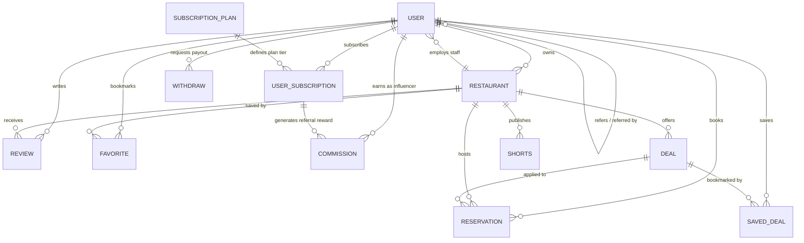

# Djarna Backend API

> [](https://dashboard.djarna.com)  
> [](https://play.google.com/store/apps/details?id=com.mohamed.djarna)  
> [](https://apps.apple.com/us/app/djarna/id6787214492)

A robust, production-grade backend API for **Djarna** — a peer-to-peer (P2P) social marketplace application. It supports product listings, real-time messaging, negotiation bidding/offers, secure payments, order management, feedback reviews, and push notifications.

---

## 🚀 Core Features

### 👤 Authentication & Profiles
- **JWT-Based Authentication**: Secure access token and refresh token rotation.
- **OTP Verification**: Email-based and SMS-based OTP verification using Nodemailer and Twilio.
- **Social Login**: Integrated passport strategies for Apple, Google, and Facebook auth.
- **Identity Verification**: Document upload and review workflows for KYC and verified user badging.
- **Follow System**: Users can follow and unfollow sellers, tracking popular merchants.

### 🛍️ Product Listings
- **Search & Filters**: Multi-criteria search (terms, category, subcategory, sub-subcategories, price limits, gender, sizes, brands, etc.).
- **Effective Boosting**: Dynamic promotional package calculations (`isEffectiveBoosted` checks expiration dates in real-time).
- **Favorites & Wishlist**: Bookmark favorite items for future purchasing.

### 💬 Real-Time Chat & Offers
- **WebSockets (Socket.io)**: Real-time messaging and chat threads sync.
- **Rich Message Formats**: Standard text, location sharing, and file attachments (images, PDFs, documents).
- **Negotiation System**:
  - Propose custom price and shipping offers.
  - Real-time offer updating, accepting, counter-offering, or rejecting.
  - Automatic push notifications and socket sync alerts on state changes.

### 💳 Orders & Payments
- **Secure Checkouts**: Built-in payment flow utilizing the **Paydunya** invoice checkouts and redirect mechanisms.
- **Payment Webhooks**: Paydunya webhook integrations to capture successful transactions, automatically mark products as SOLD, create orders, and complete pending offers.
- **Dispute Claims**: Users can raise order disputes to claim refunds.

### 🔔 Notifications & Cron Jobs
- **Push Notifications**: Firebase Cloud Messaging (FCM) integration for direct device alerts.
- **Cron Schedules**: Automatic cleanups for expired boost packages and uncompleted/cancelled actions.

---

## 🛠️ Technology Stack
- **Runtime**: [Node.js](https://nodejs.org/) (v18+)
- **Language**: [TypeScript](https://www.typescriptlang.org/)
- **Web Framework**: [Express.js](https://expressjs.com/)
- **Database**: [MongoDB](https://www.mongodb.com/) (using [Mongoose ODM](https://mongoosejs.com/))
- **Real-Time Communication**: [Socket.io](https://socket.io/)
- **Push Notification Service**: [Firebase Admin SDK](https://firebase.google.com/docs/admin)
- **Validation Middleware**: [Zod](https://zod.dev/)
- **File Uploads**: [Multer](https://github.com/expressjs/multer) & [Sharp](https://sharp.pixelplumbing.com/) (image optimization)

---

## 🧠 System Architecture & Workflow Analysis

### 1. Real-Time WebSockets Architecture (Socket.io)
The system initiates a central Socket.io service mapped onto the HTTP server. Clients authenticate during handshake (`_id` and `role`).
- **Room Structure**:
  - `user_${userId}`: Individual user room where real-time chat updates, read statuses, and personal notification sync events are emitted.
  - `admin_room`: Room joined exclusively by users with the `ADMIN` role. Receives real-time dashboard events and system action logs.
- **Key Events**:
  - `message_updated`: Sent to conversation participants when a message text changes or when an offer status changes (`ACCEPTED`/`REJECTED`).
  - `conversation_deleted` / `message_deleted`: Notifies the user's active client session to clear the cached views.
  - `new_activity`: Admin-specific push event logging actions (e.g. product listings, disputes, checkouts) dynamically onto the admin dashboards.

### 2. P2P Bidding & Negotiation Flow
Negotiation parameters are stored directly on the message model to preserve the contextual sequence of the negotiation:
- **Offering**: Buyers propose a deal by emitting a message of type `OFFER` accompanied by `offerPrice` and optional `shippingPrice`.
- **Counter-Offering / Updating**: Either participant can update the offer details through the `/offer-price` patch, automatically triggering real-time Socket syncing and Firebase Push alerts.
- **Accepting & Rejecting**: Modifying the offer status (to `ACCEPTED` or `REJECTED`) sends push notifications back to the offer sender to prompt them to check out.
- **Completion**: Once payment is completed via the webhook checkouts, the status shifts to `COMPLETED`, locking down modifications and closing negotiation.

### 3. Automated Background Operations (Cron Jobs)
Automated tasks are scheduled using `node-cron` to maintain system consistency and clean stale states:
- **Product Boost Cleanup** (Runs every 12 hours: `0 */12 * * *`):
  - Scans for products where `isBoosted` is true but `boostEndTime` has passed.
  - Reverts boost properties and dispatches a push notification (`Boost terminé`) to notify the listing owner.
- **Escrow Release Agent** (Runs every hour: `0 * * * *`):
  - Checks complete orders and finds payments where escrow is enabled (`escrow: true`), the countdown holds (`escrowReleaseAt < now`), and funds have not yet been disbursed.
  - Releases funds, increments the seller's active wallet balance, fires socket alerts, marks the order state as `COMPLETED`, updates product inventory status to `SOLD`, and notifies the seller via FCM.

### 4. Memory-Storage Upload & Image Compression Pipeline (Multer + Sharp)
To prevent disk storage leaks from unprocessed original images, the upload pipeline processes binary streams directly inside memory buffers:
- **Multer Configuration**: Parses incoming multipart form streams into a temporary RAM buffer (`multer.memoryStorage()`) limiting image files to `5MB` (or general message files up to `15MB`).
- **Sharp WebP Compression Engine**:
  - **Profiles**: Converted to high-efficiency `.webp` format at a quality parameter of `80`.
  - **Marketplace Listings**: Scaled to a max dimension bounding box of `800x800px` (preserving aspect ratio via `fit: "inside"`) and exported as WebP (quality 80) to maximize loading speeds on mobile client feeds.
  - **KYC Verification Documents / Disputes**: Scaled to a bounding box of `1200x1200px` and encoded to WebP to balance clarity and low storage overhead.
  - **Category Icons**: Resized to a thumbnail cover of `200x200px` at quality `70`.
  - **Message Attachments**: General files (e.g. PDFs, ZIPs) bypass the Sharp compression pipeline and write directly to disk, whereas images are converted to WebP on the fly.

### 5. Third-Party Integrations
- **Paydunya Checkout Gateway**: Integrates sandbox and live checkouts via redirection tokens. Includes IPN webhook listeners validating invoices, updating payment schemas (`status`, `receiptUrl`), marking listing items as `SOLD`, and triggering notifications.
- **Twilio SMS Gateway**: Dispenses mobile verification OTP notifications to validate phone number authenticity.
- **Nodemailer SMTP**: Triggers secure registration/recovery emails and transactional checks.

---

## 🗄️ Database Relationships & Schemas Analysis

Below is an overview of the core database schema models and how they relate across the ecosystem:


```mermaid
erDiagram
    USER ||--o{ RESTAURANT : "owns"
    USER ||--o{ RESERVATION : "books"
    USER ||--o{ USER_SUBSCRIPTION : "subscribes"
    USER ||--o{ REVIEW : "writes"
    USER ||--o{ FAVORITE : "bookmarks"
    USER ||--o{ SAVED_DEAL : "saves"
    USER ||--o{ COMMISSION : "earns as influencer"
    USER ||--o{ WITHDRAW : "requests payout"
    USER ||--o{ USER : "refers / referred by"

    RESTAURANT ||--o{ USER : "employs staff"
    RESTAURANT ||--o{ DEAL : "offers"
    RESTAURANT ||--o{ RESERVATION : "hosts"
    RESTAURANT ||--o{ SHORTS : "publishes"
    RESTAURANT ||--o{ REVIEW : "receives"
    RESTAURANT ||--o{ FAVORITE : "saved by"

    DEAL ||--o{ RESERVATION : "applied to"
    DEAL ||--o{ SAVED_DEAL : "bookmarked by"

    SUBSCRIPTION_PLAN ||--o{ USER_SUBSCRIPTION : "defines plan tier"
    USER_SUBSCRIPTION ||--o{ COMMISSION : "generates referral reward"
```

---

### Detailed Schemas & Complete Data Definitions

#### 1. `USER` Schema
Represents platform members, customers, restaurant owners, staff members, and influencer affiliates.

| Field | Data Type | Modifiers / Ref | Description |
| :--- | :--- | :--- | :--- |
| `_id` | `ObjectId` | Primary Key | Unique User Identifier |
| `name` | `String` | Required | Full display name |
| `email` | `String` | Unique, Sparse | User email address |
| `phone` | `String` | Required | Mobile phone number |
| `password` | `String` | Select: false | Encrypted credentials |
| `role` | `Enum` | `"USER"` \| `"RESTAURANT_OWNER"` \| `"STAFF"` \| `"ADMIN"` | Platform access level |
| `avatar` | `String` | Optional | Profile image URL |
| `referredBy` | `ObjectId` | Ref: `USER` | Influencer / Referrer ID |
| `referralCode` | `String` | Unique | Unique referral string |
| `walletBalance` | `Number` | Default: `0` | Available withdrawal earnings balance |
| `isActive` | `Boolean` | Default: `true` | Account active state |
| `createdAt` / `updatedAt` | `Date` | Timestamp | Schema record timestamps |

---

#### 2. `RESTAURANT` Schema
Represents restaurant profiles, venue metadata, staff assignments, and location coordinates.

| Field | Data Type | Modifiers / Ref | Description |
| :--- | :--- | :--- | :--- |
| `_id` | `ObjectId` | Primary Key | Unique Restaurant ID |
| `owner` | `ObjectId` | Ref: `USER` | Restaurant Owner User ID |
| `name` | `String` | Required | Restaurant business name |
| `description` | `String` | Optional | Detailed business bio / summary |
| `coverImage` | `String` | Optional | Main header/banner image URL |
| `gallery` | `Array<String>` | Default: `[]` | Venue gallery image URLs |
| `cuisineTypes` | `Array<String>` | Required | Cuisine tags (e.g. Italian, Sushi) |
| `location` | `Object` | `{ lat: Number, lng: Number, address: String }` | Geolocation and street address |
| `openingHours` | `Object` | `{ open: String, close: String, days: Array<String> }` | Business operational hours |
| `rating` | `Number` | Default: `0` | Aggregated user review score |
| `reviewCount` | `Number` | Default: `0` | Total number of reviews received |
| `staff` | `Array<ObjectId>` | Ref: `USER` | Associated staff user accounts |
| `isActive` | `Boolean` | Default: `true` | Restaurant listing status |
| `createdAt` / `updatedAt` | `Date` | Timestamp | Entity timestamps |

---

#### 3. `DEAL` Schema
Promotions, discount vouchers, and special dining offers created by restaurants.

| Field | Data Type | Modifiers / Ref | Description |
| :--- | :--- | :--- | :--- |
| `_id` | `ObjectId` | Primary Key | Unique Deal ID |
| `restaurant` | `ObjectId` | Ref: `RESTAURANT` | Host restaurant ID |
| `title` | `String` | Required | Deal headline |
| `description` | `String` | Optional | Terms & conditions / offer details |
| `discountPercentage` | `Number` | Required | Percentage discount (e.g. `20%`) |
| `validFrom` | `Date` | Required | Offer start timestamp |
| `validUntil` | `Date` | Required | Offer expiration timestamp |
| `maxRedemptions` | `Number` | Optional | Maximum total booking limit |
| `status` | `Enum` | `"ACTIVE"` \| `"EXPIRED"` \| `"DISABLED"` | Deal operational state |
| `createdAt` / `updatedAt` | `Date` | Timestamp | Record timestamps |

---

#### 4. `RESERVATION` Schema
Booking contracts between dining users and host restaurants, incorporating applied deals.

| Field | Data Type | Modifiers / Ref | Description |
| :--- | :--- | :--- | :--- |
| `_id` | `ObjectId` | Primary Key | Unique Reservation ID |
| `user` | `ObjectId` | Ref: `USER` | Customer User ID |
| `restaurant` | `ObjectId` | Ref: `RESTAURANT` | Host Restaurant ID |
| `deal` | `ObjectId` | Ref: `DEAL` (Optional) | Applied deal or offer ID |
| `partySize` | `Number` | Required | Number of dining guests |
| `reservationTime` | `Date` | Required | Scheduled dining date & time |
| `status` | `Enum` | `"PENDING"` \| `"CONFIRMED"` \| `"COMPLETED"` \| `"CANCELLED"` \| `"NO_SHOW"` | Booking lifecycle status |
| `specialRequests` | `String` | Optional | Table preferences / dietary notes |
| `createdAt` / `updatedAt` | `Date` | Timestamp | Booking timestamps |

---

#### 5. `SHORTS` Schema
Engaging short video clips published by restaurants for promotion and food discovery.

| Field | Data Type | Modifiers / Ref | Description |
| :--- | :--- | :--- | :--- |
| `_id` | `ObjectId` | Primary Key | Unique Short ID |
| `restaurant` | `ObjectId` | Ref: `RESTAURANT` | Publishing restaurant ID |
| `videoUrl` | `String` | Required | Streaming video file URL |
| `thumbnail` | `String` | Optional | Video thumbnail preview image URL |
| `caption` | `String` | Optional | Short description / hashtags |
| `likesCount` | `Number` | Default: `0` | Total user likes count |
| `viewsCount` | `Number` | Default: `0` | Total video views count |
| `createdAt` / `updatedAt` | `Date` | Timestamp | Upload timestamps |

---

#### 6. `SUBSCRIPTION_PLAN` Schema
Tier configurations for paid user or restaurant membership plans.

| Field | Data Type | Modifiers / Ref | Description |
| :--- | :--- | :--- | :--- |
| `_id` | `ObjectId` | Primary Key | Unique Subscription Plan ID |
| `name` | `String` | Required | Plan tier name (e.g. Premium VIP) |
| `price` | `Number` | Required | Recurring subscription fee |
| `billingCycle` | `Enum` | `"MONTHLY"` \| `"YEARLY"` | Billing frequency |
| `features` | `Array<String>` | Default: `[]` | Included features and privileges |
| `isActive` | `Boolean` | Default: `true` | Plan availability status |

---

#### 7. `USER_SUBSCRIPTION` Schema
Active membership subscriptions purchased by users or venues, linked to referral commissions.

| Field | Data Type | Modifiers / Ref | Description |
| :--- | :--- | :--- | :--- |
| `_id` | `ObjectId` | Primary Key | Unique Subscription Record ID |
| `user` | `ObjectId` | Ref: `USER` | Subscriber User ID |
| `plan` | `ObjectId` | Ref: `SUBSCRIPTION_PLAN` | Plan tier reference |
| `startDate` | `Date` | Required | Subscription activation date |
| `endDate` | `Date` | Required | Expiration date |
| `status` | `Enum` | `"ACTIVE"` \| `"EXPIRED"` \| `"CANCELLED"` | Current subscription state |
| `paymentId` | `String` | Optional | Transaction payment reference |

---

#### 8. `COMMISSION` Schema
Referral rewards and affiliate earnings generated when referred users purchase subscriptions.

| Field | Data Type | Modifiers / Ref | Description |
| :--- | :--- | :--- | :--- |
| `_id` | `ObjectId` | Primary Key | Unique Commission ID |
| `influencer` | `ObjectId` | Ref: `USER` | User receiving the commission reward |
| `subscription` | `ObjectId` | Ref: `USER_SUBSCRIPTION` | Source subscription generating reward |
| `amount` | `Number` | Required | Calculated commission payout amount |
| `status` | `Enum` | `"PENDING"` \| `"PAID"` \| `"CANCELLED"` | Payout status |
| `createdAt` | `Date` | Timestamp | Reward generation date |

---

#### 9. `SAVED_DEAL` & `FAVORITE` Schemas
Bookmarks and saved listings created by users.

- **`SAVED_DEAL`**: Maps `user` ID to saved `deal` ID with timestamp.
- **`FAVORITE`**: Maps `user` ID to bookmarked `restaurant` ID with timestamp.

---

#### 10. `REVIEW` Schema
User reviews, star ratings, and feedback left for restaurants.

| Field | Data Type | Modifiers / Ref | Description |
| :--- | :--- | :--- | :--- |
| `_id` | `ObjectId` | Primary Key | Unique Review ID |
| `user` | `ObjectId` | Ref: `USER` | Review author ID |
| `restaurant` | `ObjectId` | Ref: `RESTAURANT` | Target restaurant ID |
| `rating` | `Number` | Required (1-5) | Star rating score |
| `comment` | `String` | Optional | Text review feedback |
| `createdAt` | `Date` | Timestamp | Review creation timestamp |

---

#### 11. `WITHDRAW` Schema
Payout requests submitted by influencers or users to withdraw earned wallet commissions.

| Field | Data Type | Modifiers / Ref | Description |
| :--- | :--- | :--- | :--- |
| `_id` | `ObjectId` | Primary Key | Unique Withdrawal ID |
| `user` | `ObjectId` | Ref: `USER` | Requesting User ID |
| `amount` | `Number` | Required | Payout amount requested |
| `payoutMethod` | `String` | Required | Payment method (Mobile Money / Bank) |
| `accountDetails` | `Object` | Required | Account number or mobile string |
| `status` | `Enum` | `"PENDING"` \| `"APPROVED"` \| `"COMPLETED"` \| `"REJECTED"` | Disbursement status |
| `createdAt` / `updatedAt` | `Date` | Timestamp | Request timestamps |

---

## ⚙️ Initial Startup Seeding

---

## ⚙️ Initial Startup Seeding
During initialization, the application executes pre-start seeding scripts to guarantee baseline security and settings:
- **Admin Seeding (`seedAdmin`)**: Creates a default Super Administrator user from `.env` parameters if no admin account exists in the database.
- **Platform Seeding (`seedSettings`)**: Pre-populates the settings collection with platform configurations (such as a default `10%` commission rate and a standard `7` days escrow release countdown).

---

## ⚙️ Setup and Installation

### 1. Clone the repository & Install dependencies
```bash
git clone <repository-url>
cd Djarna_App_Backend
npm install
```

### 2. Configure Environment Variables
Create a `.env` file in the root directory and copy the contents from `.env.example`:
```bash
cp .env.example .env
```
Fill in the values for your MongoDB URL, JWT tokens, Twilio credentials, and Paydunya merchant keys.

### 3. Setup Firebase Service Account
For push notifications, place your Firebase Private Key JSON file inside the `config/` directory with the name:
`djarna-b212e-firebase-adminsdk-fbsvc-ed19886f3e.json`

---

## 🏃 Running the Application

### Development Mode (with hot-reloads)
```bash
npm run dev
```

### Production Build
```bash
# Compile TypeScript to JavaScript in /dist
npm run build

# Start production server
npm run start
```

### Linter Checks
```bash
# Run ESLint rules check
npm run lint

# Automatically resolve fixing rules
npm run lint:fix
```
