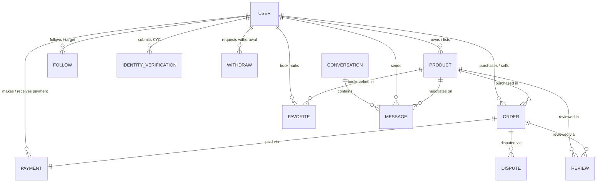

# Djarna Backend API

> [](https://dashboard.djarna.com)  
> [](https://play.google.com/store/apps/details?id=com.mohamed.djarna)  
> [](https://apps.apple.com/us/app/djarna/id6787214492)

A robust, production-grade backend API for **Djarna** — a peer-to-peer (P2P) social marketplace application. It supports product listings, real-time messaging, negotiation bidding/offers, secure payments, order management, feedback reviews, and push notifications.

---

## 🚀 Core Features

### 👤 Authentication & Profiles
- **JWT-Based Authentication**: Secure access token and refresh token rotation.
- **OTP Verification**: Email-based and SMS-based OTP verification using Nodemailer and Twilio.
- **Social Login**: Integrated passport strategies for Apple, Google, and Facebook auth.
- **Identity Verification**: Document upload and review workflows for KYC and verified user badging.
- **Follow System**: Users can follow and unfollow sellers, tracking popular merchants.

### 🛍️ Product Listings
- **Search & Filters**: Multi-criteria search (terms, category, subcategory, sub-subcategories, price limits, gender, sizes, brands, etc.).
- **Effective Boosting**: Dynamic promotional package calculations (`isEffectiveBoosted` checks expiration dates in real-time).
- **Favorites & Wishlist**: Bookmark favorite items for future purchasing.

### 💬 Real-Time Chat & Offers
- **WebSockets (Socket.io)**: Real-time messaging and chat threads sync.
- **Rich Message Formats**: Standard text, location sharing, and file attachments (images, PDFs, documents).
- **Negotiation System**:
  - Propose custom price and shipping offers.
  - Real-time offer updating, accepting, counter-offering, or rejecting.
  - Automatic push notifications and socket sync alerts on state changes.

### 💳 Orders & Payments
- **Secure Checkouts**: Built-in payment flow utilizing the **Paydunya** invoice checkouts and redirect mechanisms.
- **Payment Webhooks**: Paydunya webhook integrations to capture successful transactions, automatically mark products as SOLD, create orders, and complete pending offers.
- **Dispute Claims**: Users can raise order disputes to claim refunds.

### 🔔 Notifications & Cron Jobs
- **Push Notifications**: Firebase Cloud Messaging (FCM) integration for direct device alerts.
- **Cron Schedules**: Automatic cleanups for expired boost packages and uncompleted/cancelled actions.

---

## 🛠️ Technology Stack
- **Runtime**: [Node.js](https://nodejs.org/) (v18+)
- **Language**: [TypeScript](https://www.typescriptlang.org/)
- **Web Framework**: [Express.js](https://expressjs.com/)
- **Database**: [MongoDB](https://www.mongodb.com/) (using [Mongoose ODM](https://mongoosejs.com/))
- **Real-Time Communication**: [Socket.io](https://socket.io/)
- **Push Notification Service**: [Firebase Admin SDK](https://firebase.google.com/docs/admin)
- **Validation Middleware**: [Zod](https://zod.dev/)
- **File Uploads**: [Multer](https://github.com/expressjs/multer) & [Sharp](https://sharp.pixelplumbing.com/) (image optimization)

---

## 🧠 System Architecture & Workflow Analysis

### 1. Real-Time WebSockets Architecture (Socket.io)
The system initiates a central Socket.io service mapped onto the HTTP server. Clients authenticate during handshake (`_id` and `role`).
- **Room Structure**:
  - `user_${userId}`: Individual user room where real-time chat updates, read statuses, and personal notification sync events are emitted.
  - `admin_room`: Room joined exclusively by users with the `ADMIN` role. Receives real-time dashboard events and system action logs.
- **Key Events**:
  - `message_updated`: Sent to conversation participants when a message text changes or when an offer status changes (`ACCEPTED`/`REJECTED`).
  - `conversation_deleted` / `message_deleted`: Notifies the user's active client session to clear the cached views.
  - `new_activity`: Admin-specific push event logging actions (e.g. product listings, disputes, checkouts) dynamically onto the admin dashboards.

### 2. P2P Bidding & Negotiation Flow
Negotiation parameters are stored directly on the message model to preserve the contextual sequence of the negotiation:
- **Offering**: Buyers propose a deal by emitting a message of type `OFFER` accompanied by `offerPrice` and optional `shippingPrice`.
- **Counter-Offering / Updating**: Either participant can update the offer details through the `/offer-price` patch, automatically triggering real-time Socket syncing and Firebase Push alerts.
- **Accepting & Rejecting**: Modifying the offer status (to `ACCEPTED` or `REJECTED`) sends push notifications back to the offer sender to prompt them to check out.
- **Completion**: Once payment is completed via the webhook checkouts, the status shifts to `COMPLETED`, locking down modifications and closing negotiation.

### 3. Automated Background Operations (Cron Jobs)
Automated tasks are scheduled using `node-cron` to maintain system consistency and clean stale states:
- **Product Boost Cleanup** (Runs every 12 hours: `0 */12 * * *`):
  - Scans for products where `isBoosted` is true but `boostEndTime` has passed.
  - Reverts boost properties and dispatches a push notification (`Boost terminé`) to notify the listing owner.
- **Escrow Release Agent** (Runs every hour: `0 * * * *`):
  - Checks complete orders and finds payments where escrow is enabled (`escrow: true`), the countdown holds (`escrowReleaseAt < now`), and funds have not yet been disbursed.
  - Releases funds, increments the seller's active wallet balance, fires socket alerts, marks the order state as `COMPLETED`, updates product inventory status to `SOLD`, and notifies the seller via FCM.

### 4. Memory-Storage Upload & Image Compression Pipeline (Multer + Sharp)
To prevent disk storage leaks from unprocessed original images, the upload pipeline processes binary streams directly inside memory buffers:
- **Multer Configuration**: Parses incoming multipart form streams into a temporary RAM buffer (`multer.memoryStorage()`) limiting image files to `5MB` (or general message files up to `15MB`).
- **Sharp WebP Compression Engine**:
  - **Profiles**: Converted to high-efficiency `.webp` format at a quality parameter of `80`.
  - **Marketplace Listings**: Scaled to a max dimension bounding box of `800x800px` (preserving aspect ratio via `fit: "inside"`) and exported as WebP (quality 80) to maximize loading speeds on mobile client feeds.
  - **KYC Verification Documents / Disputes**: Scaled to a bounding box of `1200x1200px` and encoded to WebP to balance clarity and low storage overhead.
  - **Category Icons**: Resized to a thumbnail cover of `200x200px` at quality `70`.
  - **Message Attachments**: General files (e.g. PDFs, ZIPs) bypass the Sharp compression pipeline and write directly to disk, whereas images are converted to WebP on the fly.

### 5. Third-Party Integrations
- **Paydunya Checkout Gateway**: Integrates sandbox and live checkouts via redirection tokens. Includes IPN webhook listeners validating invoices, updating payment schemas (`status`, `receiptUrl`), marking listing items as `SOLD`, and triggering notifications.
- **Twilio SMS Gateway**: Dispenses mobile verification OTP notifications to validate phone number authenticity.
- **Nodemailer SMTP**: Triggers secure registration/recovery emails and transactional checks.

---

## 🗄️ Database Relationships & Schemas Analysis

### Entity Relationship Overview


```mermaid
erDiagram
    USER ||--o{ PRODUCT : "owns / lists"
    USER ||--o{ ORDER : "purchases / sells"
    USER ||--o{ PAYMENT : "makes / receives payment"
    USER ||--o{ FAVORITE : "bookmarks"
    USER ||--o{ FOLLOW : "follows / target"
    USER ||--o{ IDENTITY_VERIFICATION : "submits KYC"
    USER ||--o{ WITHDRAW : "requests withdrawal"
    PRODUCT ||--o{ ORDER : "purchased in"
    PRODUCT ||--o{ FAVORITE : "bookmarked in"
    PRODUCT ||--o{ REVIEW : "reviewed in"
    ORDER ||--|| PAYMENT : "paid via"
    ORDER ||--o{ DISPUTE : "disputed via"
    ORDER ||--o{ REVIEW : "reviewed via"
    CONVERSATION ||--o{ MESSAGE : "contains"
    USER ||--o{ MESSAGE : "sends"
    PRODUCT ||--o{ MESSAGE : "negotiates on"
```

---

### Detailed Schemas & Field Definitions

#### 1. `UserModel` (`User`)
Represents platform members, buyer accounts, sellers, and system administrators.
- `_id`: `ObjectId` — Unique user identifier.
- `name`: `String` — Full name.
- `email`: `String` (Optional, unique) — Email address.
- `phone`: `String` (Required) — Phone number.
- `password`: `String` (Hashed) — Encrypted authentication credentials.
- `role`: `Enum ["USER", "ADMIN"]` (Default: `"USER"`).
- `photo`: `String` — Profile avatar image WebP URL.
- `location`: `{ lat: Number, lng: Number }` — Geolocation coordinates.
- `address`: `{ fullName, country, addressLine1, addressLine2, postcode, city }` — Primary default address.
- `isActive`: `Boolean` — Active status identifier.
- `isPhoneVerified`: `Boolean` — OTP phone verification status.
- `verifiedBadge`: `Boolean` — KYC verified identity badge flag.
- `lastLogin`: `Date` — Timestamp of last session.
- `referralCode`: `String` — Unique user referral code.
- `referredBy`: `Ref<User>` — Referrer user ID reference.
- `balance`: `Number` (Default: `0`) — Account balance funds (FCFA).
- `noCommission`: `Number` (Default: `0`) — Bonus count for zero-commission sales.
- `fcmTokens`: `Array<String>` — Array of Firebase Cloud Messaging device tokens for push notifications.
- `resetPasswordOtp`, `resetPasswordOtpExpiry`, `resetPasswordToken`, `resetPasswordTokenExpiry`: Security verification tokens.
- `createdAt`, `updatedAt`: Timestamps.

#### 2. `ProductModel` (`Product`)
Core marketplace listing entity for items buy/sell/negotiate.
- `_id`: `ObjectId` — Product ID.
- `user`: `Ref<User>` — Seller/owner of the product.
- `title`: `String` — Item title.
- `description`: `String` — Detailed item description.
- `price`: `Number` — Base asking price.
- `currency`: `String` (Default: `"FCFA"`).
- `images`: `Array<String>` — Array of compressed WebP image URLs.
- `category`: `Ref<Category>` — Main category.
- `subcategory`: `Ref<Category>` — Sub-category ID.
- `subSubcategory`: `Ref<Category>` — Sub-sub category ID.
- `condition`: `Enum ["NEW_WITH_TAG", "NEW_WITHOUT_TAG", "VERY_GOOD", "GOOD", "SATISFACTORY"]`.
- `gender`: `Enum ["MEN", "WOMEN", "UNISEX", "KIDS"]`.
- `size`: `Array<String>` — Applicable sizing options.
- `brand`: `String` — Item brand / designer name.
- `colors`: `Array<String>` — Color variants.
- `material`: `String` — Fabric/material details.
- `shippingPayer`: `Enum ["BUYER", "SELLER"]`.
- `shippingCost`: `Number` — Standard shipping fee.
- `shippingAddress`: `Ref<ShippingAddress>` — Pickup address reference.
- `status`: `Enum ["AVAILABLE", "RESERVED", "SOLD", "INACTIVE"]` (Default: `"AVAILABLE"`).
- `views`: `Number` — Dynamic item view counter.
- `isBoosted`: `Boolean` — Active boost promotion status.
- `boostType`: `String` — Active boost tier name.
- `boostEndTime`: `Date` — Expiry timestamp of active boost.
- `isEffectiveBoosted`: `Boolean` (Virtual) — Evaluates whether boost is currently valid and non-expired.
- `createdAt`, `updatedAt`: Timestamps.

#### 3. `OrderModel` (`Order`)
Tracks purchase agreements and item fulfillment states between buyers and sellers.
- `_id`: `ObjectId` — Order ID.
- `orderId`: `String` — Human-readable order reference code.
- `buyer`: `Ref<User>` — Purchasing user.
- `seller`: `Ref<User>` — Selling user.
- `product`: `Ref<Product>` — Ordered marketplace item.
- `itemPrice`: `Number` — Item sale price.
- `shippingCost`: `Number` — Shipping fee applied.
- `buyerFee`: `Number` — Platform buyer protection fee.
- `totalAmount`: `Number` — Total invoice charge.
- `shippingAddress`: `{ fullName, phone, addressLine1, addressLine2, city, country, postcode }`.
- `status`: `Enum ["PENDING", "PROCESSING", "SHIPPED", "DELIVERED", "COMPLETED", "CANCELLED", "DISPUTED"]`.
- `payment`: `Ref<Payment>` — Associated payment transaction record.
- `trackingNumber`: `String` — Delivery parcel tracking code.
- `carrier`: `String` — Shipping courier service.
- `cancelledBy`: `Ref<User>` / `cancelReason`: `String`.
- `createdAt`, `updatedAt`: Timestamps.

#### 4. `PaymentModel` (`Payment`)
Governs online transaction processing, Paydunya invoices, and escrow lockups.
- `_id`: `ObjectId` — Transaction ID.
- `order`: `Ref<Order>` — Linked order ID.
- `user`: `Ref<User>` — Payer/Buyer ID.
- `seller`: `Ref<User>` — Recipient/Seller ID.
- `amount`: `Number` — Net total paid.
- `productPrice`: `Number` — Base product portion.
- `shippingCost`: `Number` — Shipping amount.
- `buyerFee`: `Number` — Buyer fee retained.
- `siteFee`: `Number` — System commission fee retained by admin.
- `sellerEarnings`: `Number` — Final amount credited to seller balance.
- `paymentMethod`: `Enum ["PAYDUNYA", "WALLET", "CARD"]`.
- `status`: `Enum ["PENDING", "COMPLETED", "FAILED", "REFUNDED"]`.
- `paydunyaToken`: `String` — Payment gateway session reference.
- `receiptUrl`: `String` — Official transaction invoice link.
- `escrow`: `Boolean` — Flag indicating funds held in escrow.
- `escrowReleaseAt`: `Date` — Release threshold date (e.g. +7 days after order).
- `escrowReleasedAt`: `Date` — Actual timestamp of funds release to seller balance.
- `createdAt`, `updatedAt`: Timestamps.

#### 5. `ConversationModel` & `MessageModel` (`Message`)
Manages P2P direct messaging streams and embedded negotiable price offers.
- **Conversation**:
  - `_id`: `ObjectId` — Thread ID.
  - `participants`: `Array<Ref<User>>` — Pair of users in conversation.
  - `product`: `Ref<Product>` — Related product context.
  - `lastMessage`: `Ref<Message>` — Snippet reference for rapid listing.
  - `updatedAt`: `Date`.
- **Message**:
  - `_id`: `ObjectId` — Message ID.
  - `conversation`: `Ref<Conversation>` — Parent chat room.
  - `sender`: `Ref<User>` — Sender user ID.
  - `recipient`: `Ref<User>` — Target user ID.
  - `type`: `Enum ["MESSAGE", "LOCATION", "OFFER", "ACCEPTED", "REJECTED", "CANCELLED", "COMPLETED"]`.
  - `text`: `String` — Chat message payload.
  - `file`: `{ url, fileName, fileType, fileSize }` — Attached image or document.
  - `location`: `{ lat, lng, address }` — Shared location payload.
  - `product`: `Ref<Product>` — Product subject of negotiation.
  - `offerPrice`: `Number` — Negotiated custom offer item price.
  - `shippingPrice`: `Number` — Negotiated custom shipping fee.
  - `offerStatus`: `Enum ["PENDING", "ACCEPTED", "REJECTED", "CANCELLED", "COMPLETED"]`.
  - `isRead`: `Boolean` — Read receipt indicator.
  - `createdAt`, `updatedAt`: Timestamps.

#### 6. `DisputeModel` (`Dispute`)
Handles buyer claims, return requests, and administrative dispute resolution.
- `_id`: `ObjectId` — Dispute ID.
- `order`: `Ref<Order>` — Order being disputed.
- `buyer`: `Ref<User>` — Claimant.
- `seller`: `Ref<User>` — Defendant seller.
- `reason`: `String` — Selected dispute categorization.
- `description`: `String` — Detailed complaint statement.
- `images`: `Array<String>` — Proof media uploads.
- `status`: `Enum ["PENDING", "UNDER_REVIEW", "RESOLVED", "REFUNDED", "REJECTED"]`.
- `adminNote`: `String` — Internal review log notes.
- `resolvedAt`: `Date` — Closure timestamp.
- `createdAt`, `updatedAt`: Timestamps.

#### 7. `IdentityVerificationModel` (`IdentityVerification`)
Manages KYC (Know Your Customer) identity verification requests submitted by sellers.
- `_id`: `ObjectId` — Verification record ID.
- `user`: `Ref<User>` — Applicant user reference.
- `idType`: `Enum ["NATIONAL_ID", "PASSPORT", "DRIVING_LICENSE"]`.
- `idNumber`: `String` — Document reference number.
- `frontImage`: `String` — Document front WebP image URL.
- `backImage`: `String` — Document back WebP image URL.
- `selfieImage`: `String` — Face verification image URL.
- `status`: `Enum ["PENDING", "APPROVED", "REJECTED"]`.
- `rejectionReason`: `String` — Admin denial explanation.
- `reviewedBy`: `Ref<User>` — Reviewer admin ID.
- `reviewedAt`: `Date` — Review completion timestamp.
- `createdAt`, `updatedAt`: Timestamps.

#### 8. `CategoryModel` (`Category`)
Multi-level category hierarchy organizing products (`Category` -> `Subcategory` -> `SubSubcategory`).
- `_id`: `ObjectId` — Category ID.
- `name`: `String` — Display title.
- `slug`: `String` — Unique URL slug.
- `image`: `String` — Optimized icon thumbnail URL.
- `parent`: `Ref<Category>` — Parent category reference (null for root categories).
- `level`: `Number` — Depth indicator (`0`: Category, `1`: Subcategory, `2`: SubSubcategory).
- `isActive`: `Boolean`.

#### 9. `ReviewModel` (`Review`)
Star ratings and feedback written after order completion.
- `_id`: `ObjectId` — Review ID.
- `order`: `Ref<Order>` — Validated purchase order reference.
- `reviewer`: `Ref<User>` — Author of the feedback.
- `reviewee`: `Ref<User>` — User receiving the rating.
- `rating`: `Number` (1 to 5) — Star score.
- `comment`: `String` — Review text.
- `createdAt`, `updatedAt`: Timestamps.

#### 10. `FavoriteModel` & `FollowModel`
- **Favorite (`IFavorite`)**: Maps `user` ID to bookmarked `product` ID.
- **Follow (`IFollow`)**: Maps `follower` (user who follows) to `following` (seller account being followed).

#### 11. `BoostPackModel` & `BoostPaymentModel`
- **BoostPack (`IBoostPack`)**: Defines listing promotion packages (e.g. `title`, `durationDays`, `price`, `description`, `isActive`).
- **BoostPayment (`IBoostPayment`)**: Records payments made by users to boost product visibility (`user`, `product`, `boostPack`, `amount`, `paymentMethod`, `status`, `paydunyaToken`).

#### 12. `WithdrawModel` (`IWithdraw`)
Tracks seller wallet payout/withdrawal requests.
- `_id`: `ObjectId` — Request ID.
- `user`: `Ref<User>` — Requesting seller.
- `amount`: `Number` — FCFA requested payout amount.
- `paymentMethod`: `String` (e.g., Wave, Orange Money, Bank Transfer).
- `accountDetails`: `Object` — Recipient account information.
- `status`: `Enum ["PENDING", "APPROVED", "REJECTED", "COMPLETED"]`.
- `adminNote`: `String` — Administrative note.
- `createdAt`, `updatedAt`: Timestamps.

#### 13. `PlatformSettingsModel` (`IPlatformSettings`)
Global system configurations governed by super administrators.
- `commissionRate`: `Number` (Default: `10%`).
- `escrowDays`: `Number` (Default: `7` days lockup).
- `buyerProtectionFeePercent`: `Number`.
- `flatBuyerProtectionFee`: `Number`.

---

## ⚙️ Initial Startup Seeding
During initialization, the application executes pre-start seeding scripts to guarantee baseline security and settings:
- **Admin Seeding (`seedAdmin`)**: Creates a default Super Administrator user from `.env` parameters if no admin account exists in the database.
- **Platform Seeding (`seedSettings`)**: Pre-populates the settings collection with platform configurations (such as a default `10%` commission rate and a standard `7` days escrow release countdown).

---

## ⚙️ Setup and Installation

### 1. Clone the repository & Install dependencies
```bash
git clone <repository-url>
cd Djarna_App_Backend
npm install
```

### 2. Configure Environment Variables
Create a `.env` file in the root directory and copy the contents from `.env.example`:
```bash
cp .env.example .env
```
Fill in the values for your MongoDB URL, JWT tokens, Twilio credentials, and Paydunya merchant keys.

### 3. Setup Firebase Service Account
For push notifications, place your Firebase Private Key JSON file inside the `config/` directory with the name:
`djarna-b212e-firebase-adminsdk-fbsvc-ed19886f3e.json`

---

## 🏃 Running the Application

### Development Mode (with hot-reloads)
```bash
npm run dev
```

### Production Build
```bash
# Compile TypeScript to JavaScript in /dist
npm run build

# Start production server
npm run start
```

### Linter Checks
```bash
# Run ESLint rules check
npm run lint

# Automatically resolve fixing rules
npm run lint:fix
```
