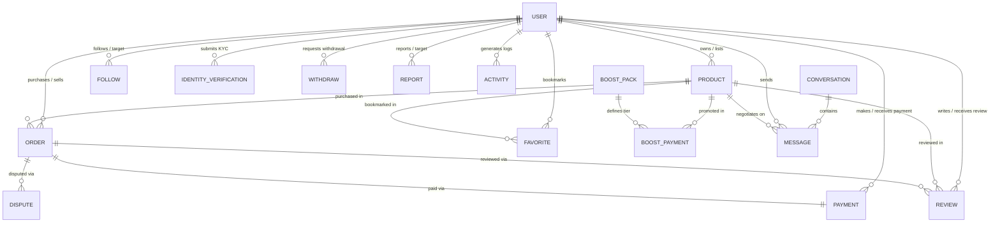

# Djarna Backend API

> [](https://dashboard.djarna.com)  
> [](https://play.google.com/store/apps/details?id=com.mohamed.djarna)  
> [](https://apps.apple.com/us/app/djarna/id6787214492)

A robust, production-grade backend API for **Djarna** — a peer-to-peer (P2P) social marketplace application. It supports product listings, real-time messaging, negotiation bidding/offers, secure payments, order management, feedback reviews, and push notifications.

---

## 🚀 Core Features

### 👤 Authentication & Profiles
- **JWT-Based Authentication**: Secure access token and refresh token rotation.
- **OTP Verification**: Email-based and SMS-based OTP verification using Nodemailer and Twilio.
- **Social Login**: Integrated passport strategies for Apple, Google, and Facebook auth.
- **Identity Verification**: Document upload and review workflows for KYC and verified user badging.
- **Follow System**: Users can follow and unfollow sellers, tracking popular merchants.

### 🛍️ Product Listings
- **Search & Filters**: Multi-criteria search (terms, category, subcategory, sub-subcategories, price limits, gender, sizes, brands, etc.).
- **Effective Boosting**: Dynamic promotional package calculations (`isEffectiveBoosted` checks expiration dates in real-time).
- **Favorites & Wishlist**: Bookmark favorite items for future purchasing.

### 💬 Real-Time Chat & Offers
- **WebSockets (Socket.io)**: Real-time messaging and chat threads sync.
- **Rich Message Formats**: Standard text, location sharing, and file attachments (images, PDFs, documents).
- **Negotiation System**:
  - Propose custom price and shipping offers.
  - Real-time offer updating, accepting, counter-offering, or rejecting.
  - Automatic push notifications and socket sync alerts on state changes.

### 💳 Orders & Payments
- **Secure Checkouts**: Built-in payment flow utilizing the **Paydunya** invoice checkouts and redirect mechanisms.
- **Payment Webhooks**: Paydunya webhook integrations to capture successful transactions, automatically mark products as SOLD, create orders, and complete pending offers.
- **Dispute Claims**: Users can raise order disputes to claim refunds.

### 🔔 Notifications & Cron Jobs
- **Push Notifications**: Firebase Cloud Messaging (FCM) integration for direct device alerts.
- **Cron Schedules**: Automatic cleanups for expired boost packages and uncompleted/cancelled actions.

---

## 🛠️ Technology Stack
- **Runtime**: [Node.js](https://nodejs.org/) (v18+)
- **Language**: [TypeScript](https://www.typescriptlang.org/)
- **Web Framework**: [Express.js](https://expressjs.com/)
- **Database**: [MongoDB](https://www.mongodb.com/) (using [Mongoose ODM](https://mongoosejs.com/))
- **Real-Time Communication**: [Socket.io](https://socket.io/)
- **Push Notification Service**: [Firebase Admin SDK](https://firebase.google.com/docs/admin)
- **Validation Middleware**: [Zod](https://zod.dev/)
- **File Uploads**: [Multer](https://github.com/expressjs/multer) & [Sharp](https://sharp.pixelplumbing.com/) (image optimization)

---

## 🧠 System Architecture & Workflow Analysis

### 1. Real-Time WebSockets Architecture (Socket.io)
The system initiates a central Socket.io service mapped onto the HTTP server. Clients authenticate during handshake (`_id` and `role`).
- **Room Structure**:
  - `user_${userId}`: Individual user room where real-time chat updates, read statuses, and personal notification sync events are emitted.
  - `admin_room`: Room joined exclusively by users with the `ADMIN` role. Receives real-time dashboard events and system action logs.
- **Key Events**:
  - `message_updated`: Sent to conversation participants when a message text changes or when an offer status changes (`ACCEPTED`/`REJECTED`).
  - `conversation_deleted` / `message_deleted`: Notifies the user's active client session to clear the cached views.
  - `new_activity`: Admin-specific push event logging actions (e.g. product listings, disputes, checkouts) dynamically onto the admin dashboards.

### 2. P2P Bidding & Negotiation Flow
Negotiation parameters are stored directly on the message model to preserve the contextual sequence of the negotiation:
- **Offering**: Buyers propose a deal by emitting a message of type `OFFER` accompanied by `offerPrice` and optional `shippingPrice`.
- **Counter-Offering / Updating**: Either participant can update the offer details through the `/offer-price` patch, automatically triggering real-time Socket syncing and Firebase Push alerts.
- **Accepting & Rejecting**: Modifying the offer status (to `ACCEPTED` or `REJECTED`) sends push notifications back to the offer sender to prompt them to check out.
- **Completion**: Once payment is completed via the webhook checkouts, the status shifts to `COMPLETED`, locking down modifications and closing negotiation.

### 3. Automated Background Operations (Cron Jobs)
Automated tasks are scheduled using `node-cron` to maintain system consistency and clean stale states:
- **Product Boost Cleanup** (Runs every 12 hours: `0 */12 * * *`):
  - Scans for products where `isBoosted` is true but `boostEndTime` has passed.
  - Reverts boost properties and dispatches a push notification (`Boost terminé`) to notify the listing owner.
- **Escrow Release Agent** (Runs every hour: `0 * * * *`):
  - Checks complete orders and finds payments where escrow is enabled (`escrow: true`), the countdown holds (`escrowReleaseAt < now`), and funds have not yet been disbursed.
  - Releases funds, increments the seller's active wallet balance, fires socket alerts, marks the order state as `COMPLETED`, updates product inventory status to `SOLD`, and notifies the seller via FCM.

### 4. Memory-Storage Upload & Image Compression Pipeline (Multer + Sharp)
To prevent disk storage leaks from unprocessed original images, the upload pipeline processes binary streams directly inside memory buffers:
- **Multer Configuration**: Parses incoming multipart form streams into a temporary RAM buffer (`multer.memoryStorage()`) limiting image files to `5MB` (or general message files up to `15MB`).
- **Sharp WebP Compression Engine**:
  - **Profiles**: Converted to high-efficiency `.webp` format at a quality parameter of `80`.
  - **Marketplace Listings**: Scaled to a max dimension bounding box of `800x800px` (preserving aspect ratio via `fit: "inside"`) and exported as WebP (quality 80) to maximize loading speeds on mobile client feeds.
  - **KYC Verification Documents / Disputes**: Scaled to a bounding box of `1200x1200px` and encoded to WebP to balance clarity and low storage overhead.
  - **Category Icons**: Resized to a thumbnail cover of `200x200px` at quality `70`.
  - **Message Attachments**: General files (e.g. PDFs, ZIPs) bypass the Sharp compression pipeline and write directly to disk, whereas images are converted to WebP on the fly.

### 5. Third-Party Integrations
- **Paydunya Checkout Gateway**: Integrates sandbox and live checkouts via redirection tokens. Includes IPN webhook listeners validating invoices, updating payment schemas (`status`, `receiptUrl`), marking listing items as `SOLD`, and triggering notifications.
- **Twilio SMS Gateway**: Dispenses mobile verification OTP notifications to validate phone number authenticity.
- **Nodemailer SMTP**: Triggers secure registration/recovery emails and transactional checks.

---

## 🗄️ Database Relationships & Schemas Analysis

### Entity Relationship Overview


```mermaid
erDiagram
    USER ||--o{ PRODUCT : "owns / lists"
    USER ||--o{ ORDER : "purchases / sells"
    USER ||--o{ PAYMENT : "makes / receives payment"
    USER ||--o{ FAVORITE : "bookmarks"
    USER ||--o{ FOLLOW : "follows / target"
    USER ||--o{ IDENTITY_VERIFICATION : "submits KYC"
    USER ||--o{ WITHDRAW : "requests withdrawal"
    USER ||--o{ REPORT : "reports / target"
    USER ||--o{ REVIEW : "writes / receives review"
    USER ||--o{ ACTIVITY : "generates logs"
    PRODUCT ||--o{ ORDER : "purchased in"
    PRODUCT ||--o{ FAVORITE : "bookmarked in"
    PRODUCT ||--o{ REVIEW : "reviewed in"
    PRODUCT ||--o{ BOOST_PAYMENT : "promoted in"
    ORDER ||--|| PAYMENT : "paid via"
    ORDER ||--o{ DISPUTE : "disputed via"
    ORDER ||--o{ REVIEW : "reviewed via"
    CONVERSATION ||--o{ MESSAGE : "contains"
    USER ||--o{ MESSAGE : "sends"
    PRODUCT ||--o{ MESSAGE : "negotiates on"
    BOOST_PACK ||--o{ BOOST_PAYMENT : "defines tier"
```

---

### Detailed Schemas & Complete Data Definitions

#### 1. `UserModel` (`User`) — `users` collection
Represents platform members, buyer accounts, sellers, and system administrators.

| Field | Data Type | Modifiers / Ref | Description |
| :--- | :--- | :--- | :--- |
| `_id` | `ObjectId` | Primary Key, Auto | Unique User ID |
| `name` | `String` | Required | Full display name |
| `email` | `String` | Optional, Unique, Sparse | User email address |
| `password` | `String` | Required, Select: false | Hashed password credentials |
| `phone` | `String` | Required | Mobile phone number |
| `role` | `Enum` | `"USER"` \| `"ADMIN"` (Default: `"USER"`) | System role & permissions |
| `photo` | `String` | Optional | Avatar WebP image URL |
| `location` | `Object` | `{ lat?: Number, lng?: Number }` | Coordinates for geolocation search |
| `address` | `Object` | `{ fullName, country, addressLine1, addressLine2, postcode, city }` | Primary default mailing address |
| `isActive` | `Boolean` | Default: `true` | Account lock / active flag |
| `isPhoneVerified` | `Boolean` | Default: `false` | SMS OTP verification badge status |
| `verifiedBadge` | `Boolean` | Default: `false` | KYC Identity badge verification status |
| `lastLogin` | `Date` | Optional | Last successful login timestamp |
| `resetPasswordOtp` | `String` | Optional | OTP for password resets |
| `resetPasswordOtpExpiry` | `Date` | Optional | Password reset OTP expiration |
| `resetPasswordToken` | `String` | Optional | Bearer token for password reset |
| `resetPasswordTokenExpiry` | `Date` | Optional | Reset token expiration |
| `phoneVerificationOtp` | `String` | Optional | Phone OTP code |
| `phoneVerificationExpiry` | `Date` | Optional | Phone OTP expiration timestamp |
| `oauthProvider` | `Enum` | `"GOOGLE"` \| `"FACEBOOK"` \| `"APPLE"` | Social login provider |
| `oauthId` | `String` | Optional | Provider unique User ID |
| `referralCode` | `String` | Required, Unique | Unique code for referral program |
| `referredBy` | `ObjectId` | Ref: `User` (Optional) | Referrer user reference |
| `balance` | `Number` | Default: `0` | Available wallet balance in FCFA |
| `noCommission` | `Number` | Default: `0` | Remaining count for zero-commission sales |
| `fcmTokens` | `Array<String>` | Default: `[]` | Firebase Cloud Messaging device push tokens |
| `createdAt` | `Date` | Auto Timestamp | Schema creation date |
| `updatedAt` | `Date` | Auto Timestamp | Schema last update date |

---

#### 2. `ProductModel` (`Product`) — `products` collection
Core marketplace listing entity for items bought, sold, or negotiated.

| Field | Data Type | Modifiers / Ref | Description |
| :--- | :--- | :--- | :--- |
| `_id` | `ObjectId` | Primary Key, Auto | Unique Product ID |
| `user` | `ObjectId` | Ref: `User` (Required) | Owner/Seller reference |
| `title` | `String` | Required | Listing title |
| `description` | `String` | Required | Detailed item description |
| `price` | `Number` | Required | Primary sale price (FCFA) |
| `originalPrice` | `Number` | Optional | Original retail price for comparison |
| `category` | `ObjectId` | Ref: `Category` (Required) | Main category |
| `subcategory` | `ObjectId` | Ref: `Category` (Required) | Subcategory ID |
| `subSubcategory` | `ObjectId` | Ref: `Category` (Required) | Sub-subcategory ID |
| `subSubSubcategory` | `ObjectId` | Ref: `Category` (Optional) | Level 3 subcategory |
| `location` | `Object` | `{ lat?: Number, lng?: Number }` | Item location coordinates |
| `address` | `String` | Optional | Physical pickup address text |
| `gender` | `Enum` | `"MEN"` \| `"WOMEN"` \| `"KID"` (Optional) | Target gender tag |
| `size` | `Enum` | `"XS"` \| `"S"` \| `"M"` \| `"L"` \| `"XL"` \| `"XXL"` \| `"XXXL"` \| `"4XL"` \| `"5XL"` \| `"6XL"` \| `"7XL"` \| `"8XL"` | Apparel size variant |
| `brand` | `String` | Optional | Brand / Designer name |
| `material` | `String` | Optional | Item material composition |
| `images` | `Array<String>` | Required | Compressed WebP image URLs |
| `status` | `Enum` | `"ACTIVE"` \| `"SOLD"` \| `"PENDING"` \| `"REJECTED"` \| `"DRAFT"` \| `"PAUSED"` | Marketplace availability status |
| `isBoosted` | `Boolean` | Default: `false` | Dynamic promotion status flag |
| `boostPack` | `ObjectId` | Ref: `BoostPack` (Optional) | Active promotion package ID |
| `boostStartTime` | `Date` | Optional | Promotion start timestamp |
| `boostEndTime` | `Date` | Optional | Promotion expiration timestamp |
| `isDeleted` | `Boolean` | Default: `false` | Soft delete flag |
| `createdAt` | `Date` | Auto Timestamp | Creation timestamp |
| `updatedAt` | `Date` | Auto Timestamp | Last update timestamp |

---

#### 3. `OrderModel` (`Order`) — `orders` collection
Tracks purchase contracts and item fulfillment states between buyers and sellers.

| Field | Data Type | Modifiers / Ref | Description |
| :--- | :--- | :--- | :--- |
| `_id` | `ObjectId` | Primary Key, Auto | Unique Order ID |
| `buyer` | `ObjectId` | Ref: `User` (Required) | Purchaser ID |
| `seller` | `ObjectId` | Ref: `User` (Required) | Merchant ID |
| `product` | `ObjectId` | Ref: `Product` (Required) | Purchased product item ID |
| `address` | `ObjectId` | Ref: `ShippingAddress` (Optional) | Shipping address reference |
| `deliveryMethod` | `Enum` | `"HOME_DELIVERY"` \| `"PICKUP_POINT"` \| `"MEET_UP"` | Selected logistics method |
| `status` | `Enum` | `"PENDING"` \| `"SHIPPED"` \| `"DELIVERED"` \| `"CANCELLED"` \| `"COMPLETED"` \| `"DISPUTED"` | Order lifecycle state |
| `productPrice` | `Number` | Required | Net item price |
| `buyerProtectionFee` | `Number` | Required | Buyer insurance & protection fee |
| `shippingCost` | `Number` | Required | Parcel delivery charge |
| `totalAmount` | `Number` | Required | Gross total invoice amount |
| `buyerFee` | `Number` | Required | Net buyer platform fee |
| `siteFee` | `Number` | Required | Net marketplace commission retained |
| `payment` | `ObjectId` | Ref: `Payment` (Optional) | Linked payment transaction record |
| `isDeleted` | `Boolean` | Default: `false` | Soft delete indicator |
| `createdAt` | `Date` | Auto Timestamp | Order placement timestamp |
| `updatedAt` | `Date` | Auto Timestamp | Order modification timestamp |

---

#### 4. `PaymentModel` (`Payment`) — `payments` collection
Governs transactional payment processing, Paydunya invoices, and escrow holds.

| Field | Data Type | Modifiers / Ref | Description |
| :--- | :--- | :--- | :--- |
| `_id` | `ObjectId` | Primary Key, Auto | Unique Payment Transaction ID |
| `userId` | `ObjectId` | Ref: `User` (Required) | Buyer / Payer ID |
| `sellerId` | `ObjectId` | Ref: `User` (Required) | Seller / Payee ID |
| `productId` | `ObjectId` | Ref: `Product` (Required) | Product item ID |
| `messageId` | `ObjectId` | Ref: `Message` (Optional) | Negotiated offer message ID reference |
| `addressId` | `ObjectId` | Ref: `ShippingAddress` (Optional) | Delivery address ID |
| `productPrice` | `Number` | Required | Item selling price |
| `buyerProtectionFee` | `Number` | Required | Buyer protection fee |
| `shippingCost` | `Number` | Required | Shipping fee |
| `totalAmount` | `Number` | Required | Total amount debited |
| `siteFee` | `Number` | Required | Admin commission cut |
| `buyerFee` | `Number` | Required | Platform processing fee |
| `escrow` | `Boolean` | Default: `true` | Escrow lock status |
| `escrowReleaseAt` | `Date` | Optional | Automatic escrow release threshold date |
| `escrowReleasedAt` | `Date` | Optional | Actual date funds released to seller balance |
| `currency` | `Enum` | `"FCFA"` \| `"USD"` \| `"EUR"` (Default: `"FCFA"`) | Transaction currency |
| `status` | `Enum` | `"PENDING"` \| `"COMPLETED"` \| `"FAILED"` \| `"REFUNDED"` \| `"CANCELLED"` \| `"DISPUTED"` | Payment processing state |
| `method` | `Enum` | `"PAYDUNYA"` \| `"CARD"` \| `"MOBILE_MONEY"` \| `"WALLET"` \| `"APPLE_PAY"` \| `"GOOGLE_PAY"` | Payment Gateway used |
| `transactionId` | `String` | Optional | Internal reference transaction ID |
| `paydunyaInvoiceToken` | `String` | Optional | Gateway session token |
| `paydunyaReceiptUrl` | `String` | Optional | External receipt URL |
| `description` | `String` | Optional | Payment line item description |
| `metadata` | `Object` | Optional | Additional gateway metadata payload |
| `paidAt` | `Date` | Optional | Timestamp payment completed |
| `createdAt` | `Date` | Auto Timestamp | Creation date |
| `updatedAt` | `Date` | Auto Timestamp | Modification date |

---

#### 5. `ConversationModel` & `MessageModel` — `conversations` & `messages` collections
Manages P2P direct chat rooms and embedded offer negotiations.

##### A. `ConversationModel`
| Field | Data Type | Modifiers / Ref | Description |
| :--- | :--- | :--- | :--- |
| `_id` | `ObjectId` | Primary Key, Auto | Conversation Thread ID |
| `participants` | `Array<ObjectId>` | Ref: `User` (Required) | Array of participating user IDs |
| `product` | `ObjectId` | Ref: `Product` (Required) | Associated product context |
| `lastMessage` | `ObjectId` | Ref: `Message` (Optional) | Quick lookup snippet for latest message |
| `createdAt` / `updatedAt` | `Date` | Auto Timestamp | Room creation & activity timestamps |

##### B. `MessageModel`
| Field | Data Type | Modifiers / Ref | Description |
| :--- | :--- | :--- | :--- |
| `_id` | `ObjectId` | Primary Key, Auto | Unique Message ID |
| `conversation` | `ObjectId` | Ref: `Conversation` (Required) | Parent chat room ID |
| `sender` | `ObjectId` | Ref: `User` (Required) | Message author ID |
| `recipient` | `ObjectId` | Ref: `User` (Required) | Message receiver ID |
| `type` | `Enum` | `"MESSAGE"` \| `"LOCATION"` \| `"OFFER"` \| `"ACCEPTED"` \| `"REJECTED"` \| `"CANCELLED"` \| `"COMPLETED"` | Type of message payload |
| `text` | `String` | Optional | Plaintext chat body |
| `file` | `Object` | `{ url, fileName, fileType, fileSize }` | Attached image or document payload |
| `location` | `Object` | `{ lat, lng, address }` | Shared GPS coordinates payload |
| `product` | `ObjectId` | Ref: `Product` (Optional) | Negotiated product ID |
| `offerPrice` | `Number` | Optional | Negotiated proposed item price |
| `shippingPrice` | `Number` | Optional | Negotiated proposed shipping cost |
| `offerStatus` | `Enum` | `"PENDING"` \| `"ACCEPTED"` \| `"REJECTED"` \| `"CANCELLED"` \| `"COMPLETED"` | Negotiated offer lifecycle state |
| `isRead` | `Boolean` | Default: `false` | Read receipt boolean |
| `createdAt` / `updatedAt` | `Date` | Auto Timestamp | Message timestamps |

---

#### 6. `DisputeModel` (`Dispute`) — `disputes` collection
Handles buyer order claims, return requests, and administrative dispute resolution.

| Field | Data Type | Modifiers / Ref | Description |
| :--- | :--- | :--- | :--- |
| `_id` | `ObjectId` | Primary Key, Auto | Unique Dispute ID |
| `order` | `ObjectId` | Ref: `Order` (Required) | Target disputed order ID |
| `payment` | `ObjectId` | Ref: `Payment` (Required) | Target disputed payment ID |
| `buyer` | `ObjectId` | Ref: `User` (Required) | Claimant (Buyer) ID |
| `seller` | `ObjectId` | Ref: `User` (Required) | Defendant (Seller) ID |
| `reason` | `Enum` | `"ITEM_NOT_RECEIVED"` \| `"ITEM_NOT_AS_DESCRIBED"` \| `"DAMAGED_ITEM"` \| `"UNAUTHORIZED_TRANSACTION"` \| `"OTHER"` | Dispute categorization reason |
| `description` | `String` | Required | Detailed complaint description |
| `images` | `Array<String>` | Optional | Evidence media attachment WebP URLs |
| `status` | `Enum` | `"PENDING"` \| `"RESOLVED"` \| `"CANCELLED"` | Dispute resolution state |
| `adminNote` | `String` | Optional | Internal admin resolution comments |
| `refundAmount` | `Number` | Optional | Partial/Full refund amount awarded to buyer |
| `resolvedAt` | `Date` | Optional | Date dispute was officially closed |
| `createdAt` / `updatedAt` | `Date` | Auto Timestamp | Dispute creation & update dates |

---

#### 7. `IdentityVerificationModel` (`IdentityVerification`) — `identityverifications` collection
Manages KYC identity verification documents submitted by sellers.

| Field | Data Type | Modifiers / Ref | Description |
| :--- | :--- | :--- | :--- |
| `_id` | `ObjectId` | Primary Key, Auto | Unique Verification ID |
| `user` | `ObjectId` | Ref: `User` (Required) | Applicant User ID |
| `documentType` | `Enum` | `"NID"` \| `"PASSPORT"` | Identity document type |
| `frontImage` | `String` | Required | Document front WebP image URL |
| `backImage` | `String` | Optional | Document back WebP image URL |
| `selfieImage` | `String` | Required | Live selfie check WebP URL |
| `status` | `Enum` | `"PENDING"` \| `"APPROVED"` \| `"REJECTED"` | Admin approval decision state |
| `adminComment` | `String` | Optional | Reason for denial or review feedback |
| `createdAt` / `updatedAt` | `Date` | Auto Timestamp | Submission & review timestamps |

---

#### 8. `CategoryModel` (`Category`) — `categories` collection
Hierarchical category taxonomy for cataloging items (`Category` -> `Subcategory` -> `SubSubcategory`).

| Field | Data Type | Modifiers / Ref | Description |
| :--- | :--- | :--- | :--- |
| `_id` | `ObjectId` | Primary Key, Auto | Unique Category ID |
| `name` | `String` | Required | Category display title |
| `icon` | `String` | Optional | Category icon WebP image URL |
| `isActive` | `Boolean` | Default: `true` | Active status toggle |
| `parentCategory` | `ObjectId` | Ref: `Category` (Optional) | Parent category ID (Null for root levels) |
| `level` | `Number` | Required | Hierarchy depth (`0`: Root, `1`: Sub, `2`: Sub-Sub) |
| `homePosition` | `Number` | Optional | Custom display ordering rank on homepage |
| `homeVisibility` | `Boolean` | Default: `false` | Featured on homepage toggle |
| `createdAt` / `updatedAt` | `Date` | Auto Timestamp | Category timestamps |

---

#### 9. `ReviewModel` (`Review`) — `reviews` collection
Star ratings and feedback left by buyers after completed orders.

| Field | Data Type | Modifiers / Ref | Description |
| :--- | :--- | :--- | :--- |
| `_id` | `ObjectId` | Primary Key, Auto | Unique Review ID |
| `user` | `ObjectId` | Ref: `User` (Required) | Buyer writing the review |
| `seller` | `ObjectId` | Ref: `User` (Required) | Seller receiving the review |
| `product` | `ObjectId` | Ref: `Product` (Required) | Associated product ID |
| `rating` | `Number` | Required (Min: 1, Max: 5) | Star rating score |
| `comment` | `String` | Required | Detailed feedback comment text |
| `isDeleted` | `Boolean` | Default: `false` | Soft delete flag |
| `adminVisibility` | `Enum` | `"show"` \| `"hidden"` (Default: `"show"`) | Admin moderation visibility toggle |

---

#### 10. `WithdrawModel` (`Withdraw`) — `withdraws` collection
Tracks seller balance withdrawal and mobile money payout requests.

| Field | Data Type | Modifiers / Ref | Description |
| :--- | :--- | :--- | :--- |
| `_id` | `ObjectId` | Primary Key, Auto | Unique Withdrawal Request ID |
| `userId` | `ObjectId` | Ref: `User` (Required) | Requesting seller User ID |
| `amount` | `Number` | Required | Requested withdrawal amount (FCFA) |
| `status` | `Enum` | `"PENDING"` \| `"PROCESSING"` \| `"COMPLETED"` \| `"FAILED"` \| `"CANCELLED"` | Disbursement lifecycle status |
| `method` | `Enum` | `"WAVE"` \| `"ORANGE_MONEY"` \| `"FREE_MONEY"` \| `"EXPRESSO"` \| `"PAYDUNYA"` | Disbursement payment provider |
| `accountNumber` | `String` | Required | Mobile money phone number or Paydunya wallet account |
| `transactionId` | `String` | Optional | Internal payout reference ID |
| `paydunyaTransactionId` | `String` | Optional | Paydunya disbursement transaction ID |
| `paydunyaDisbursementToken` | `String` | Optional | Paydunya API payout token |
| `failReason` | `String` | Optional | Reason for payout failure |
| `metadata` | `Object` | Optional | Provider response payload |
| `createdAt` / `updatedAt` | `Date` | Auto Timestamp | Payout request timestamps |

---

#### 11. `BoostPackModel` & `BoostPaymentModel` — `boostpacks` & `boostpayments`
Defines and tracks seller promotional listings and homepage highlights.

##### A. `BoostPackModel` (`IBoostPack`)
| Field | Data Type | Modifiers / Ref | Description |
| :--- | :--- | :--- | :--- |
| `_id` | `ObjectId` | Primary Key, Auto | Boost Package ID |
| `name` | `String` | Required | Package name (e.g. "7 Days Spotlight") |
| `description` | `String` | Optional | Promotional feature description |
| `type` | `Enum` | `"PRODUCT"` \| `"SHOP"` | Promotion target entity |
| `duration` | `Number` | Required | Promotion validity duration in days |
| `price` | `Number` | Required | Package cost (FCFA) |
| `currency` | `String` | Default: `"FCFA"` | Currency |
| `features` | `Array<String>` | Default: `[]` | List of package feature highlights |
| `isActive` | `Boolean` | Default: `true` | Available for purchase toggle |
| `isRecommended` | `Boolean` | Default: `false` | Featured package badge toggle |
| `isDeleted` | `Boolean` | Default: `false` | Soft delete flag |

##### B. `BoostPaymentModel` (`IBoostPayment`)
| Field | Data Type | Modifiers / Ref | Description |
| :--- | :--- | :--- | :--- |
| `_id` | `ObjectId` | Primary Key, Auto | Boost Payment ID |
| `userId` | `ObjectId` | Ref: `User` (Required) | Purchasing User ID |
| `productId` | `ObjectId` | Ref: `Product` (Optional) | Promoted product ID (if type is PRODUCT) |
| `boostPackId` | `ObjectId` | Ref: `BoostPack` (Required) | Purchased boost pack ID |
| `type` | `Enum` | `"PRODUCT"` \| `"SHOP"` | Boost application type |
| `amount` | `Number` | Required | Amount paid (FCFA) |
| `currency` | `String` | Required | Currency |
| `status` | `Enum` | `"PENDING"` \| `"COMPLETED"` \| `"FAILED"` \| `"CANCELLED"` | Payment status |
| `paydunyaInvoiceToken` | `String` | Optional | Paydunya invoice reference token |
| `paydunyaReceiptUrl` | `String` | Optional | Gateway receipt link |
| `transactionId` | `String` | Optional | Transaction ID |
| `paidAt` | `Date` | Optional | Payment confirmation timestamp |

---

#### 12. `ReportModel` (`Report`) — `reports` collection
Tracks community-submitted flags against improper product listings or abusive users.

| Field | Data Type | Modifiers / Ref | Description |
| :--- | :--- | :--- | :--- |
| `_id` | `ObjectId` | Primary Key, Auto | Database ID |
| `reportId` | `String` | Required, Unique | Human-readable report ticket ID |
| `type` | `Enum` | `"LISTING"` \| `"USER"` | Target type of report |
| `reportedItem` | `ObjectId` | Ref: `Product` (Optional) | Reported product listing ID |
| `reporter` | `ObjectId` | Ref: `User` (Required) | Reporting user ID |
| `reportedUser` | `ObjectId` | Ref: `User` (Required) | Reported target user ID |
| `reason` | `String` | Required | Primary reason tag |
| `details` | `String` | Optional | Reporter's additional explanation |
| `status` | `Enum` | `"OPEN"` \| `"IN_REVIEW"` \| `"RESOLVED"` | Ticket processing status |
| `createdAt` / `updatedAt` | `Date` | Auto Timestamp | Report ticket timestamps |

---

#### 13. `ActivityModel` (`Activity`) — `activities` collection
System audit trail logging platform operations in real time.

| Field | Data Type | Modifiers / Ref | Description |
| :--- | :--- | :--- | :--- |
| `_id` | `ObjectId` | Primary Key, Auto | Activity log entry ID |
| `user` | `ObjectId` | Ref: `User` (Required) | User performing the action |
| `type` | `Enum` | `"LOGIN"` \| `"REGISTER"` \| `"PRODUCT_CREATE"` \| `"PRODUCT_UPDATE"` \| `"PRODUCT_DELETE"` \| `"ORDER_PLACED"` \| `"ORDER_STATUS_UPDATE"` \| `"PAYMENT_COMPLETED"` \| `"WITHDRAWAL_REQUEST"` \| `"DISPUTE_CREATED"` \| `"DISPUTE_RESOLVED"` \| `"REFUND_PROCESSED"` \| `"IDENTITY_VERIFICATION"` \| `"REPORT_CREATE"` etc. | Event taxonomy classification |
| `message` | `String` | Required | Human-readable activity message |
| `details` | `Object` | Optional | Key-value contextual metadata |
| `isDeleted` | `Boolean` | Default: `false` | Soft delete flag |
| `createdAt` / `updatedAt` | `Date` | Auto Timestamp | Activity timestamp |

---

#### 14. `PlatformSettingsModel` (`IPlatformSettings`) — `settings` collection
Global system settings governed by platform super administrators.

| Section | Field | Data Type | Description |
| :--- | :--- | :--- | :--- |
| `payment` | `commissionRate` | `Number` | Default platform sales commission percentage (e.g. `10%`) |
| `payment` | `escrowDuration` | `Number` | Standard escrow lockup duration in hours |
| `currency` | `primary` | `Enum ("XOF", "EUR", "USD", "GBP")` | Base operational currency |
| `currency` | `supported` | `Array<Currency>` | Enabled platform checkout currencies |
| `location` | `countries` / `cities` | `Array<String>` | Supported geographical service zones |
| `notifications` | `email` / `push` | `Boolean` | Master toggle switches for system alerts |

---

## ⚙️ Initial Startup Seeding

---

## ⚙️ Initial Startup Seeding
During initialization, the application executes pre-start seeding scripts to guarantee baseline security and settings:
- **Admin Seeding (`seedAdmin`)**: Creates a default Super Administrator user from `.env` parameters if no admin account exists in the database.
- **Platform Seeding (`seedSettings`)**: Pre-populates the settings collection with platform configurations (such as a default `10%` commission rate and a standard `7` days escrow release countdown).

---

## ⚙️ Setup and Installation

### 1. Clone the repository & Install dependencies
```bash
git clone <repository-url>
cd Djarna_App_Backend
npm install
```

### 2. Configure Environment Variables
Create a `.env` file in the root directory and copy the contents from `.env.example`:
```bash
cp .env.example .env
```
Fill in the values for your MongoDB URL, JWT tokens, Twilio credentials, and Paydunya merchant keys.

### 3. Setup Firebase Service Account
For push notifications, place your Firebase Private Key JSON file inside the `config/` directory with the name:
`djarna-b212e-firebase-adminsdk-fbsvc-ed19886f3e.json`

---

## 🏃 Running the Application

### Development Mode (with hot-reloads)
```bash
npm run dev
```

### Production Build
```bash
# Compile TypeScript to JavaScript in /dist
npm run build

# Start production server
npm run start
```

### Linter Checks
```bash
# Run ESLint rules check
npm run lint

# Automatically resolve fixing rules
npm run lint:fix
```
